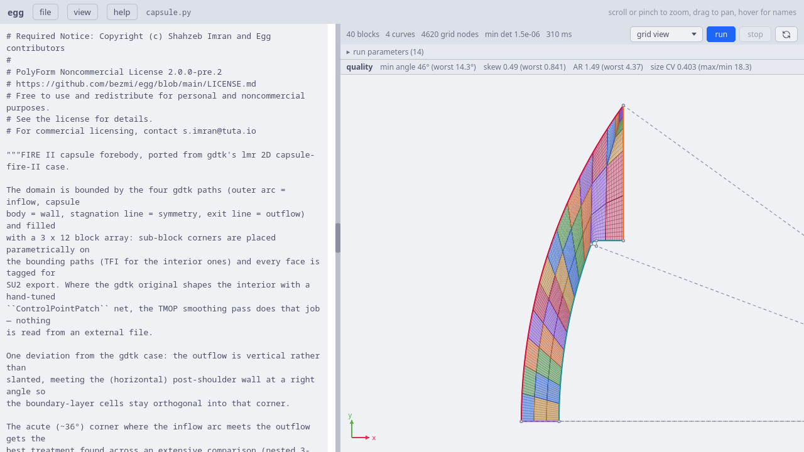
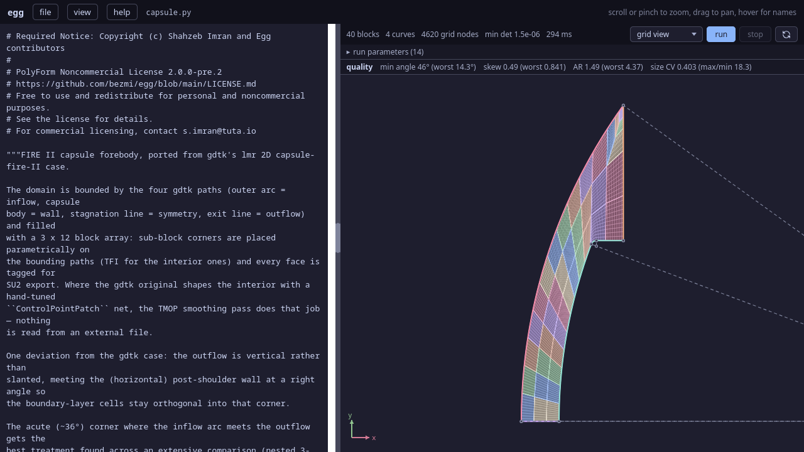
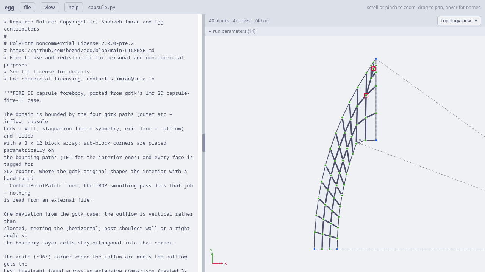
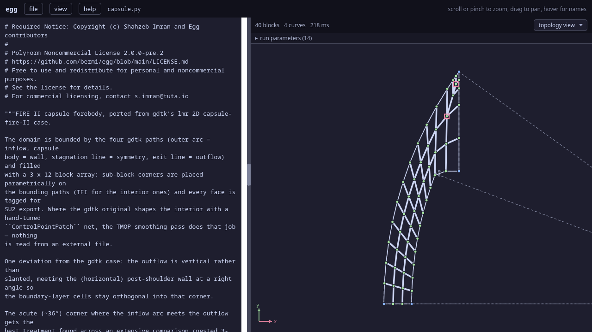
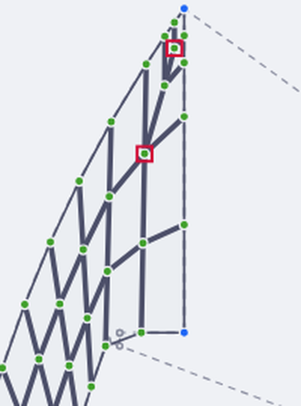
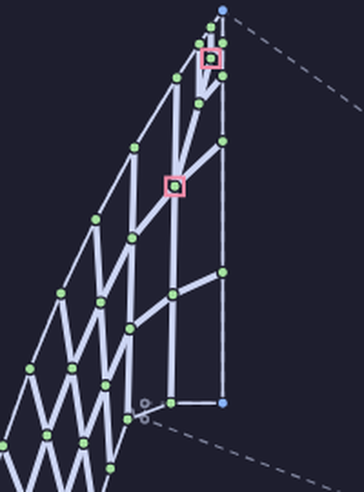

.. Required Notice: Copyright (c) Shahzeb Imran and Egg contributors
   PolyForm Noncommercial License 2.0.0-pre.2
   https://github.com/bezmi/egg/blob/main/LICENSE.md

The ``capsule-fire-II`` example
===============================

A re-entry-capsule forebody grid, ported from gdtk's ``lmr`` 2D FIRE II
case. The domain is the shock layer between the **capsule body** (the wall)
and an **outer inflow arc** standing off from it, closed by a symmetry line
at the bottom and an outflow line at the top. It is filled with a 3 × 12
block array and relaxed by the untangle + TMOP pipeline — where the gdtk
original shapes the interior with a hand-tuned control-point net, the TMOP
pass does that job, and nothing is read from an external file.

   The FIRE II forebody in the web UI (grid view), at TFI initialisation:
   the shock-layer array between the capsule body (inner, right) and the
   outer inflow arc. The dashed lines are the symmetry and outflow
   boundaries the fit zooms out to include.

   The FIRE II forebody in the web UI (grid view), at TFI initialisation:
   the shock-layer array between the capsule body (inner, right) and the
   outer inflow arc. The dashed lines are the symmetry and outflow
   boundaries the fit zooms out to include.

This example shares the structure of the others — a
:func:`build_capsule` that declares geometry and topology, a
:func:`setup` that turns knobs into a pipeline, and the two entry-point
guards — so if you have not read :doc:`the egg tutorial <egg>` yet, that is
the gentler introduction. What is new here is the treatment of the **acute
corner** where the inflow arc meets the outflow: a nested three-valent
*dipole* built from topology alone, smoothed under the size-aware
``shape_size`` metric. Both are on by default.

The file is ``examples/2D/capsule-fire-II/capsule.py`` with argument
parsing in a sibling ``driver.py``. As with the other examples we start at
the web-UI guard and walk outward.

The web UI entry point
----------------------

.. code-block:: python

   if __name__ == "__egg_webui__":  # running inside the egg web UI
       import egg_webui

       # CLI defaults, mirroring driver.py — edit freely
       a = egg_webui.params(
           res_i=10,
           res_j=10,
           bl_first_height=4.0e-4,
           bl_growth=1.3,
           pin_layers=2,
           pin_sweeps=40,
           sweeps_per_delta=20,
           tmop_sweeps=5000,
           chunk=10,
           smoother="jacobi",
           # editable() surfaces a value in the run-parameters panel with a
           # typed input; choices=[...] renders a dropdown. The classic
           # combination for comparison: metric="shape", dipole=False.
           metric=egg_webui.editable("shape_size", choices=["shape", "shape_size"]),
           dipole=egg_webui.editable(True, label="corner dipole"),
           omega=0.8,
           device="cpu",
       )
       topo, ents, grid, cfg = setup(a)
       egg_webui.run(grid, generate_steps(grid, config=cfg))

As in every example, ``a`` is the knob dict the run-parameters panel edits
in place, and the last two lines call :func:`setup` and hand the UI an
unconsumed :func:`~egg.pipeline.generate_steps` generator (see
:doc:`../webui`). Two knobs use :func:`egg_webui.editable`, which the egg
example did not:

- ``metric=egg_webui.editable("shape_size", choices=["shape",
  "shape_size"])`` renders a **dropdown**. ``editable`` is an identity
  function at runtime — it returns its first argument unchanged — but the
  panel keys off the call in the source to render the right input and
  rewrite the literal on change.
- ``dipole=egg_webui.editable(True, label="corner dipole")`` renders a
  **checkbox** (bool literal) with a friendlier panel label.

So the two headline features are one dropdown and one checkbox away from
their comparison settings — ``metric="shape"``, ``dipole=False`` reproduces
the standard single-corner-block approach.

Unlike the egg example, this ``run`` call omits ``untangle_direct``, so it
takes the default (``True``): the FIRE II TFI start can be mildly folded at
the acute corner, and the direct δ-continuation clears it in one call
rather than animating it.

``setup``: knobs, metric, and the boundary-layer target
-------------------------------------------------------

.. code-block:: python

   def setup(a):
       topo, ents = build_capsule(
           res_i=a["res_i"],
           res_j=a["res_j"],
           bl_first_height=a["bl_first_height"],
           bl_growth=a["bl_growth"],
           n_fixed=a["pin_layers"],
           dipole=a.get("dipole", True),
       )

       pin = a["bl_first_height"] > 0.0 and a["pin_layers"] > 0
       grid = topo.initialize_grid()
       metric = a.get("metric", "shape")
       cfg = PipelineConfig(
           sweeps_per_delta=a["sweeps_per_delta"],
           tmop_sweeps=a["tmop_sweeps"],
           tmop_chunk=a["chunk"],
           tmop_smoother=a["smoother"],
           tmop_metric=metric,
           cluster_boundary_layers=pin,
           omega=a["omega"],
           device=a["device"],
           pin_sweeps=a["pin_sweeps"] if pin else 0,
           respace=a["bl_first_height"] > 0.0 and not pin,
       )
       return topo, ents, grid, cfg

The pin/respace regime logic is the same three-way branch the egg tutorial
describes: with ``pin`` set, TMOP smooths against a boundary-layer clustering
target and freezes the first ``pin_layers`` rows; otherwise it runs plain and
restores the spacing with a respace post-pass (or, with no first height, no
clustering at all). ``cluster_boundary_layers=pin`` is what selects between
them — the pipeline builds the clustering target from the
``set_boundary_layer`` specs itself, so ``setup`` no longer constructs one.
Two things are worth noting.

**The metric is set once.** ``metric`` is read from the knobs and handed to
:class:`~egg.pipeline.PipelineConfig` as ``tmop_metric``. Under
``"shape_size"`` the TMOP objective is not just scale-invariant shape — it
adds a ``(det T − 1)²`` size term that pushes every cell toward a target
area, so the target must carry physical scale.

**The pipeline sizes the far field for you.** The auto-build forwards
``metric=tmop_metric`` into
:func:`~egg.smoothing.targets.build_topology_target`, so under
``shape_size`` the non-wall far-field target is sized to the grid's mean
cell volume (:func:`~egg.smoothing.targets.mean_size_target`) rather than
``IdentityTarget``'s ``det W = 1`` — which would drag every non-wall cell
toward unit area. Building the target yourself and passing it as ``target``
puts that coupling back on you: you must construct it with
``metric=config.tmop_metric`` (see the ``target`` note on
:func:`~egg.pipeline.generate_steps`).

``build_paths``: the four boundary curves
-----------------------------------------

.. code-block:: python

   def build_paths():
       """The four boundary paths of the FIRE II forebody domain (grid.lua)."""
       Ri = 0.9347  # nose radius
       ri = 0.0102  # shoulder radius
       A = 0.3358   # capsule frontal radius
       thetai = math.asin((A - ri) / (Ri - ri))
       L = 0.05     # length of conical section after the shoulder
       diffo = 0.07 # shock-layer standoff of the outer boundary
       Ro = Ri + diffo
       ...
       body = Polyline([Arc(ai, bi, oi), Arc(bi, ci, pi_), Line(ci, di)])
       ...
       outer = Arc(ao, do, oi)
       south = Line(ao, ai)
       north = Line(do, di)
       return outer, body, south, north

The geometry is lifted verbatim from the gdtk ``grid.lua``: nose radius,
shoulder radius, cone angle, and the outer-boundary standoff, all
constructed from :class:`~egg.geometry.frontend2d.Vector3` points and
gdtk-style :func:`~egg.geometry.frontend2d.Arc` / :class:`Line` /
:class:`~egg.geometry.frontend2d.Polyline` primitives. The **body** is a
polyline of two arcs (nose, shoulder) and a straight cone flank; the
**outer** boundary is a single arc standing ``diffo`` off it; **south** and
**north** are the straight symmetry and outflow lines.

One deviation from gdtk is worth calling out because it drives a later
decision:

.. code-block:: python

   # The wall is horizontal after the shoulder, so a vertical outflow meets
   # it at a right angle (the gdtk original slants it to 1.5*thetai, which
   # forces sheared cells where it meets the wall). The outer arc ends
   # directly above the wall's end point.

Making the outflow vertical means it meets the (horizontal) post-shoulder
wall orthogonally, so the boundary-layer cells stay square into that
corner. It also means ``relax_orthogonality`` (below) has nothing to do
there — it is declared only for consistency with the phoebus example, where
the outflow *is* oblique.

``build_capsule``: the block array and the dipole
-------------------------------------------------

The four curves become grid edges, oriented so axis 0 runs inflow → wall
and axis 1 runs along the body:

.. code-block:: python

   inflow = Edge(outer, name="inflow")              # west, symmetry -> outflow
   wall = Edge(body, arc_length=True, name="wall")  # east, symmetry -> outflow
   symmetry = Edge(south, name="symmetry")          # south, inflow -> wall
   outflow = Edge(north, name="outflow")            # north, inflow -> wall

Each edge is named, and that name is both its key in ``topology.entities``
and its SU2 boundary marker: :meth:`~egg.topology.builder.TopologyBuilder.build`
auto-derives the marker onto every face associated with the edge, so the four
markers fall out of the names alone with no ``tag_boundary`` calls.

The wall edge is ``arc_length=True``: the body is a composite of arcs and a
line with non-uniform native speed, so arc-length reparameterisation makes
equal steps in ``t`` cover equal distance along it — the node distribution
follows arc length, not the underlying curve's parameter.

The tensor block array
^^^^^^^^^^^^^^^^^^^^^^^

.. code-block:: python

   nib, njb = 3, 12
   j1 = njb - 1
   b = TopologyBuilder(d=2)

   skip = {(0, j1)} if dipole else set()
   corner, names = b.add_block_array(
       south=symmetry, north=outflow, west=inflow, east=wall,
       nib=nib, njb=njb, res=(nib * res_i, njb * res_j),
       skip=skip,
   )

:meth:`~egg.topology.builder.TopologyBuilder.add_block_array` is the
Eilmer ``registerFluidGridArray`` analogue: it places an ``nib × njb`` grid
of sub-block corners on the four bounding edges (sliding nodes on the
edges, bilinear TFI in the interior), declares a block for each cell,
infers the block-to-block connections from the shared corner objects, and
associates each outer face with its bounding edge. ``res`` is the *total*
cell count across the whole array, split as evenly as possible per block.
It returns the ``corner`` dict (keyed by ``(i, j)``, which the dipole below
reaches into for the ring of sub-blocks around the skipped corner cell) and
the block-name grid ``names[i][j]``.

Because the array already associated each outer face with its named edge,
every boundary marker **auto-derives**: the west column (``i = 0``) inherits
``inflow``, the east column (``i = nib − 1``) ``wall``, the south row
``symmetry``, and the north row ``outflow`` — no ``tag_boundary`` loop is
written. The ``skip`` guard omits the corner cell ``(0, j1)`` from the array
entirely, because with the dipole on that cell does not exist — it is
replaced by the hand-built blocks below, whose faces associate (and so tag)
themselves.

The nested dipole
^^^^^^^^^^^^^^^^^

The acute (~36°) corner where the inflow arc meets the outflow is the hard
part of this grid: a single block spanning that wedge has a badly stretched
cell in the tip. The dipole replaces the corner cell with ``n`` nested
rings of blocks that **telescope into the corner**, refining the tip cell
geometrically from topology alone:

.. code-block:: python

   n = 2   # nesting depth (1 = the plain 3-block dipole)
   f = 0.5 # per-level extent shrink toward the corner
   kr = [max(2, res_j // 2)] * n
   u1, v1 = 1 / nib, 1 - 1 / njb
   s_prev, an_prev, aw_prev = corner[1, j1], corner[1, njb], corner[0, j1]
   for m in range(1, n + 1):
       um, vm = u1 * f**m, 1 - (1 - v1) * f**m
       b.add_corner(f"an{m}", outflow.place_node(um), fixed=False)
       b.add_corner(f"aw{m}", inflow.place_node(vm), fixed=False)
       b.add_corner(f"s{m}", tfi_point(um, vm, symmetry, outflow, inflow, wall), fixed=False)
       b.add_block(f"b0_11b{m}", sw=f"s{m}", se=s_prev, ne=an_prev, nw=f"an{m}", res=(kr[m-1], res_j))
       b.add_block(f"b0_11c{m}", sw=aw_prev, se=s_prev, ne=f"s{m}", nw=f"aw{m}", res=(res_i, kr[m-1]))
       boundary.append((f"b0_11c{m}", 0, 0, inflow))
       boundary.append((f"b0_11b{m}", 1, 1, outflow))
       s_prev, an_prev, aw_prev = f"s{m}", f"an{m}", f"aw{m}"
   b.add_block("b0_11a", sw=aw_prev, se=s_prev, ne=an_prev, nw=corner[0, njb], res=(res_i, res_j))

Each level ``m`` adds three free corners — one sliding on the outflow
(``an{m}``), one on the inflow (``aw{m}``), and one interior TFI point
(``s{m}``) — and two blocks (``b`` and ``c``) that wrap the previous ring;
``f**m`` shrinks each level's extent toward the apex. A final block
(``b0_11a``) fills the innermost wedge at ``corner[0, njb]``, the apex where
inflow meets outflow. Every node is free — the smoother is left to place
them.

The elegant property is in the valence bookkeeping: adding a level
regularises the previous ring's central node to four-valent, so **any**
``n`` leaves exactly one three-valent node (the innermost ``s_n``) and one
five-valent node (the classic 3–5 singularity pair). More nesting means a
finer, more gradual corner refinement, not more singularities.

   Topology view: the 3 × 12 array with the dipole telescoping into the
   acute apex (top). The two red boxes near the tip are the 3–5
   singularity pair; the dashed lines are the outflow and symmetry
   boundaries.

   Topology view: the 3 × 12 array with the dipole telescoping into the
   acute apex (top). The two red boxes near the tip are the 3–5
   singularity pair; the dashed lines are the outflow and symmetry
   boundaries.

Zoomed into the corner, the nested rings and the two singularities are
clearer:

   The apex corner, magnified. The blue node at the very tip is the fixed
   inflow/outflow meeting point; the two red boxes are the five-valent node
   (where the outer array meets the dipole) and the three-valent innermost
   node. Every other node is free.

   The apex corner, magnified. The blue node at the very tip is the fixed
   inflow/outflow meeting point; the two red boxes are the five-valent node
   (where the outer array meets the dipole) and the three-valent innermost
   node. Every other node is free.

Because these dipole blocks are built by hand rather than by
``add_block_array``, their boundary faces are not auto-associated. The code
collects the associations in a ``boundary`` list — each entry now a plain
``(name, axis, side, edge)`` tuple — and applies them explicitly at the end:

.. code-block:: python

   for name, axis, side, edge in boundary:
       b.associate(name, axis, side, edge)  # marker auto-derives from edge name

Each dipole block that touches the inflow or outflow gets its face
:meth:`~egg.topology.builder.TopologyBuilder.associate`\ d to that edge, so
its nodes slide on the curve. There is no separate marker step: the tuple
carries no tag, because the physical marker auto-derives from the named
``inflow`` / ``outflow`` edge the face is associated with.

Boundary layer, build, entities
^^^^^^^^^^^^^^^^^^^^^^^^^^^^^^^^

.. code-block:: python

   if bl_first_height > 0.0:
       b.set_boundary_layer(
           wall, first_height=bl_first_height, growth=bl_growth,
           n_fixed=n_fixed, relax_orthogonality=(outflow,),
       )

   topology = b.build()
   return topology, topology.entities

The clustering request is stamped on the wall entity as before.
``relax_orthogonality=(outflow,)`` tells the target builder that the
outflow may meet the wall obliquely and, if so, to let the near-wall cells
shear into the outflow direction rather than lose their layer heights
fighting to stay orthogonal. Here the vertical outflow already meets the
wall squarely, so it is a no-op — but declaring it means a slanted outflow
(the gdtk original) would keep its layer heights without any other change.
:meth:`~egg.topology.builder.TopologyBuilder.build` then runs the
connection/association inference, auto-derives each face's SU2 marker from
the tag of its associated edge, and returns the topology, whose derived
:attr:`topology.entities` map (``{name: entity}``) the function returns for
the visualiser and marker export.

The pipeline and the two defaults
---------------------------------

The pipeline phases are the same as the egg example — ``init`` →
``untangle`` (if folded) → ``tmop`` (chunked) → ``pin`` + ``tmop`` →
``final`` — with the metric threaded through so the reported energy is
scored under the same objective TMOP optimised. The payoff of the two
defaults is measured in the module docstring, as cell-area coefficient of
variation / max-to-min ratio at ``res 10 × 10``:

=========================== ============ ================
setting                     area CV      max/min ratio
=========================== ============ ================
stock + shape               1.78         568
dipole + shape              0.74         400
stock + shape_size          0.65         47
**dipole + shape_size**     **0.47**     **79**
=========================== ============ ================

The dipole regularises the corner *geometry* and ``shape_size`` equalises
cell *areas*; together they give the most uniform grid. Set
``--no-dipole`` / ``--metric shape`` to reproduce the standard approach and
watch the corner cell balloon.

Running it from the command line
--------------------------------

.. code-block:: python

   def main():
       ...
       a = parse_args()
       topo, ents, grid, cfg = setup(vars(a))
       steps = generate_steps(grid, config=cfg, untangle_direct=not a.plot_live)
       finish(grid, topo, ents, steps, a, title="FIRE II capsule",
              mindet_title="min det A (TMOP only)")

Identical in shape to the egg CLI path: ``parse_args`` → ``setup`` →
``generate_steps`` → ``finish``. ``driver.py`` adds the two feature flags —
``--metric {shape,shape_size}`` (default ``shape_size``) and ``--dipole /
--no-dipole`` (default on) — alongside the usual resolution, boundary-layer,
smoother, and plotting flags. Run ``uv run capsule.py --help`` for the full
list.

A few things to try
-------------------

- ``--no-dipole`` reverts the acute corner to a single block — the fastest
  way to see what the dipole buys you (watch the tip cell in the grid
  view).
- ``--metric shape`` drops the size term; cells keep their shape quality
  but their areas spread out, most visibly far from the wall.
- ``--plot-topology`` draws the block skeleton and highlights the
  singularities, so you can count the 3–5 pair the dipole introduces.
- Bump the nesting depth ``n`` in ``build_capsule`` (it is a local, not a
  CLI flag) to telescope the corner refinement further.
