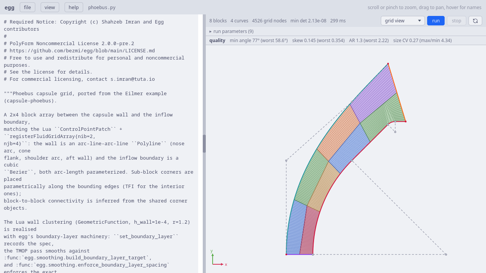
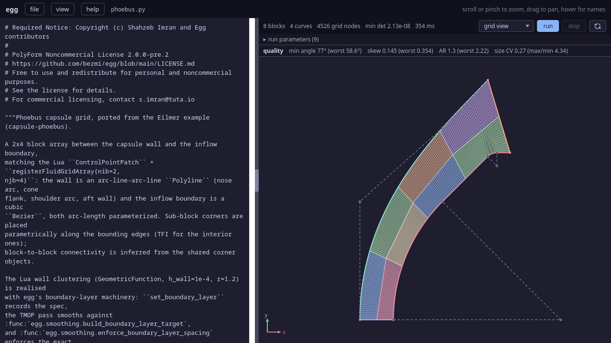
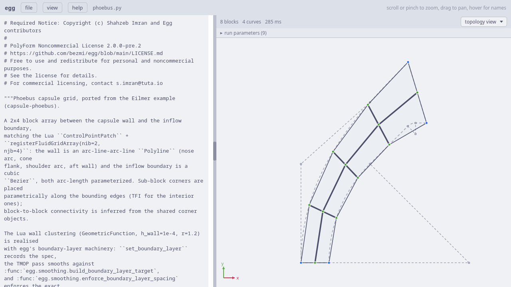
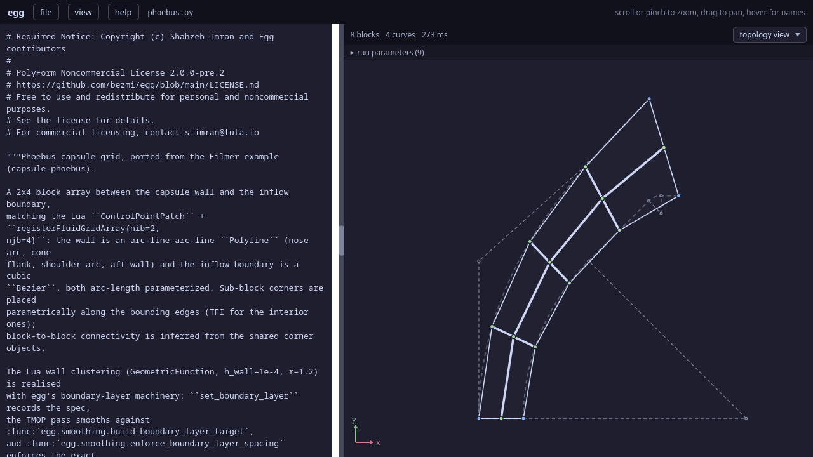

.. Required Notice: Copyright (c) Shahzeb Imran and Egg contributors
   PolyForm Noncommercial License 2.0.0-pre.2
   https://github.com/bezmi/egg/blob/main/LICENSE.md

The ``capsule-phoebus`` example
===============================

Another capsule forebody, ported from the Eilmer ``capsule-phoebus`` case
(Bianchi et al., *Int. J. Heat Mass Transfer* 177 (2021) 121430). The
domain sits between the **capsule wall** — an arc–line–arc–line profile —
and a curved **inflow boundary**, filled with a 2 × 4 block array and
relaxed by the pipeline. Where the Eilmer original massages the interior
with a hand-placed ``ControlPointPatch`` net, the TMOP pass does that job.

   The phoebus capsule in the web UI (grid view), at TFI initialisation:
   the 2 × 4 array between the capsule wall (inner, red) and the Bézier
   inflow boundary. The dashed lines are the symmetry axis (bottom) and the
   outflow (right).

   The phoebus capsule in the web UI (grid view), at TFI initialisation:
   the 2 × 4 array between the capsule wall (inner, red) and the Bézier
   inflow boundary. The dashed lines are the symmetry axis (bottom) and the
   outflow (right).

This example is the closest cousin of :doc:`capsule-fire-ii` — a block
array between a wall and an inflow, smoothed under the size-aware
``shape_size`` metric — but simpler in one way and richer in another. It
has **no dipole**: the 2 × 4 array is a plain conforming tensor grid with no
singularities. And its ``relax_orthogonality`` is *active* rather than a
formality, because the outflow genuinely meets the wall at an angle. It
also shows two geometry primitives the earlier examples didn't: a
multi-segment :class:`~egg.geometry.frontend2d.Polyline` wall and a cubic
:func:`~egg.geometry.frontend2d.Bezier` boundary, both arc-length
parameterised.

The file is ``examples/2D/capsule-phoebus/phoebus.py`` with ``driver.py``
alongside. We start, as always, at the web-UI guard.

The web UI entry point
----------------------

.. code-block:: python

   if __name__ == "__egg_webui__":  # running inside the egg web UI
       import egg_webui

       # CLI defaults, mirroring driver.py — edit freely
       a = egg_webui.params(
           grid_level=1,
           pin_layers=2,
           pin_sweeps=5000,
           tmop_sweeps=5000,
           chunk=1000,
           smoother="jacobi",
           # editable() surfaces a value in the run panel with a typed input;
           # choices=[...] renders a dropdown. metric="shape" is the classic
           # scale-invariant metric; "shape_size" also equalises cell areas.
           metric=egg_webui.editable("shape_size", choices=["shape", "shape_size"]),
           omega=0.8,
           device="cpu",
       )
       topo, ents, grid, cfg = setup(a)
       egg_webui.run(grid, generate_steps(grid, config=cfg, untangle_direct=False))

The knob dict is smaller than the capsule-fire-II one: there is no
``dipole`` (this grid has none), and the boundary-layer height and growth
are not knobs at all — they are fixed module constants ``H_WALL = 1e-4`` and
``BL_GROWTH = 1.2``, matching the Eilmer ``GeometricFunction`` clustering.
The only :func:`egg_webui.editable` call is the ``metric`` dropdown, exactly
as in capsule-fire-II. ``grid_level`` is the refinement factor (as in the
Lua example).

``untangle_direct=False`` animates the untangle phase in the live view, as
in the egg example.

``setup``: knobs to pipeline
----------------------------

.. code-block:: python

   def setup(a):
       topo, ents = build_phoebus(grid_level=a["grid_level"], n_fixed=a["pin_layers"])

       pin = a["pin_layers"] > 0
       grid = topo.initialize_grid()
       metric = a.get("metric", "shape")
       cfg = PipelineConfig(
           tmop_sweeps=a["tmop_sweeps"],
           tmop_chunk=a["chunk"],
           tmop_smoother=a["smoother"],
           tmop_metric=metric,
           cluster_boundary_layers=pin,
           omega=a["omega"],
           device=a["device"],
           pin_sweeps=a["pin_sweeps"] if pin else 0,
           respace=not pin,
       )
       return topo, ents, grid, cfg

The metric handling — ``cluster_boundary_layers`` tells the pipeline to
build the clustering target from the ``set_boundary_layer`` specs, sizing
its ``shape_size`` far-field default to the grid's mean cell volume — is
exactly the capsule-fire-II story, and the :doc:`capsule-fire-ii` tutorial
spells it out. The one difference is the ``pin`` condition. In the other
examples pin mode required a positive first height *and* ``pin_layers > 0``;
here the wall is *always* clustered (the height is a constant, not a
switchable knob), so ``pin`` depends on ``pin_layers`` alone:

- ``pin_layers > 0`` (the default, 2): ``cluster_boundary_layers`` is on, so
  TMOP smooths against the boundary-layer target, then freezes the first two
  near-wall rows at their exact heights and re-smooths (``pin_sweeps``).
- ``pin_layers == 0``: clustering off — TMOP runs on the plain metric and the
  exact respace post-pass (``respace = not pin``) restores the wall spacing
  at the end.

``build_phoebus``: geometry and the block array
-----------------------------------------------

The geometric points
^^^^^^^^^^^^^^^^^^^^^

.. code-block:: python

   Rn = 20.0e-3            # nose radius [m]
   beta = math.radians(45.0)  # cone angle [rad]
   Rs = 1.57e-3            # shoulder radius [m]
   Rb = 20.0e-3            # base radius [m]
   ...
   E = Vector3(x=D.x + L_aft, y=D.y, fixed=True)
   theta = math.atan(E.y / (Rn - E.x))
   F = Vector3(x=Rn - Rf * math.cos(theta), y=Rf * math.sin(theta), fixed=True)
   G = Vector3(x=Rn - Ri, y=0.0, fixed=True)
   centre_n = Vector3(x=Rn, y=0.0)
   centre_s = Vector3(x=D.x, y=D.y - Rs)

The dimensions are lifted verbatim from the Eilmer ``grid.lua`` — nose,
shoulder and base radii, the 45° cone angle — and the derived points ``A``
through ``G`` are computed from them. ``E``, ``F`` and ``G`` are marked
``fixed=True``: these are the outer corners of the domain (the ends of the
outflow and the start of the symmetry axis), pinned so the smoother cannot
drift them. ``centre_n`` and ``centre_s`` are the arc centres for the nose
and shoulder.

The four boundary curves
^^^^^^^^^^^^^^^^^^^^^^^^^

.. code-block:: python

   wall = Edge(
       Polyline([
           Arc(p0=A, p1=B, centre=centre_n),   # nose arc
           Line(p0=B, p1=C),                    # cone flank
           Arc(p0=C, p1=D, centre=centre_s),    # shoulder arc
           Line(p0=D, p1=E),                    # aft wall
       ]),
       arc_length=True,
       name="wall",
   )
   inflow = Edge(
       Bezier(points=[G, Vector3(x=G.x, y=B.y), Vector3(x=B.x, y=0.8 * F.y), F]),
       arc_length=True,
       name="inflow",
   )
   symm = Edge(Line(p0=G, p1=A), name="symm")       # south: symmetry axis
   outflow = Edge(Line(p0=F, p1=E), name="outflow") # north: outflow boundary

Each edge is *named*, and that name does double duty: it is the key under
which the entity is exposed on ``topology.entities`` (for drawing), and it is
the SU2 boundary marker auto-derived onto every face the block array
associates with that edge below. The Eilmer original set no markers at all;
here naming the four curves gives ``wall`` / ``inflow`` / ``symm`` /
``outflow`` markers for free, with no ``tag_boundary`` calls.

The **wall** is a four-segment :class:`~egg.geometry.frontend2d.Polyline`:
nose arc, straight cone flank, shoulder arc, and the aft wall. The
**inflow** is a cubic :func:`~egg.geometry.frontend2d.Bezier` through four
control points, curving from ``G`` on the axis up to ``F``. Both are
wrapped in arc-length :class:`~egg.geometry.frontend2d.Edge`\ s: a polyline
of arcs and lines, and a Bézier, both have wildly non-uniform native
parameter speed, so ``arc_length=True`` makes equal steps in ``t`` cover
equal distance — the node spacing follows physical arc length rather than
the underlying parameterisation. The **symm** and **outflow** edges are the
straight symmetry axis and outflow line.

The 2 × 4 block array
^^^^^^^^^^^^^^^^^^^^^^

.. code-block:: python

   n_refine = 2 ** (grid_level / 2)
   n_wall_normal = math.ceil(20 * n_refine)   # cells inflow->wall
   n_along_wall = math.ceil(100 * n_refine)   # cells along the wall

   bld = TopologyBuilder(d=2)
   bld.add_block_array(
       south=symm, north=outflow, west=inflow, east=wall,
       nib=2, njb=4,
       res=(n_wall_normal, n_along_wall),
   )

A single :meth:`~egg.topology.builder.TopologyBuilder.add_block_array` call
builds the whole grid: a 2 × 4 array over the four-edge patch, matching the
Lua ``registerFluidGridArray{nib=2, njb=4}``. Axis 0 runs west → east
(inflow → wall) and axis 1 runs south → north (along the wall), so ``res``
is ``(cells across the shock layer, cells along the body)`` in total across
the array. ``grid_level`` scales both counts. As in capsule-fire-II, the
array places the sub-block corners on the bounding edges, TFI-fills the
interior, and infers every connection and boundary association from the
shared corners — there is nothing to tag or associate by hand, and no
singularity anywhere.

The boundary layer and the oblique outflow
^^^^^^^^^^^^^^^^^^^^^^^^^^^^^^^^^^^^^^^^^^^

.. code-block:: python

   # The outflow meets the wall obliquely; relaxing orthogonality towards it
   # lets the clustering target follow it with sheared cells instead of
   # trading away the near-wall layer heights.
   bld.set_boundary_layer(
       wall,
       first_height=H_WALL,
       growth=BL_GROWTH,
       n_fixed=n_fixed,
       relax_orthogonality=(outflow,),
   )

This is where phoebus earns its ``relax_orthogonality``. The aft wall is
horizontal but the outflow line runs up to ``F`` at an angle, so the two
meet **obliquely**. Without help, the clustering target near that corner
would try to keep the near-wall cells orthogonal to the wall, rotating them
away from the outflow and sacrificing the requested layer heights.
Listing ``outflow`` in ``relax_orthogonality`` tells the target builder to
instead shear the wall-normal column into the outflow's own direction near
that corner, so the smoother follows the outflow with uniformly sheared
parallelograms and keeps the heights. (In capsule-fire-II the same argument
appears but is a no-op, because that example deliberately made the outflow
vertical; here it does real work.)

``H_WALL`` (1e-4 m) and ``BL_GROWTH`` (1.2) are the module constants
matching the Lua clustering; ``n_fixed`` is ``pin_layers`` from the knobs.

   Topology view: the 2 × 4 block skeleton. Blue corners are the pinned
   patch corners; green corners slide on their host curve. There are **no
   red boxes** — a plain conforming array has no singularities, in contrast
   to the dipole of the FIRE II case.

   Topology view: the 2 × 4 block skeleton. Blue corners are the pinned
   patch corners; green corners slide on their host curve. There are **no
   red boxes** — a plain conforming array has no singularities, in contrast
   to the dipole of the FIRE II case.

Finally :meth:`~egg.topology.builder.TopologyBuilder.build` auto-derives the
SU2 markers from the named edges, validates, and returns the topology; its
derived :attr:`topology.entities` map (``{name: entity}``, built from the
associations rather than hand-assembled) names the four curves for the
visualiser and marker export, so the function just hands it straight back:

.. code-block:: python

   topology = bld.build()
   return topology, topology.entities

The pipeline
------------

The phases are the usual sequence — ``init`` → ``untangle`` (if folded) →
``tmop`` → ``pin`` + ``tmop`` (or ``respace``) → ``final`` — with the metric
threaded through as ``tmop_metric`` so the reported energy matches the
objective TMOP optimised. Because clustering is always on, the default run
always exercises the pin phase: smooth against the boundary-layer target,
freeze the first two rows at their geometric heights, re-smooth. The
``finish`` helper reports the achieved first-layer heights relative to
their targets (``1.0`` = exact), which is the quickest check that the
clustering landed.

Running it from the command line
--------------------------------

.. code-block:: python

   def main():
       ...
       a = parse_args()
       topo, ents, grid, cfg = setup(vars(a))
       steps = generate_steps(grid, config=cfg, untangle_direct=True)
       finish(grid, topo, ents, steps, a, title="Phoebus capsule")

The same ``parse_args`` → ``setup`` → ``generate_steps`` → ``finish``
sequence. ``phoebus.py``'s ``driver.py`` is a slimmer parser than the other
capsule's: ``--grid-level``, ``--metric``, ``--pin-layers`` /
``--pin-sweeps``, the smoother and device knobs, and ``--plot-grid`` /
``--plot-topology`` — no live-animation flags, since the phoebus driver
always runs the untangle phase directly. Run ``uv run phoebus.py --help``
for the full list.

A few things to try
-------------------

- ``--metric shape`` drops the size term. Watch the cells far from the wall
  spread out in area — ``shape_size`` is what keeps them uniform.
- ``--pin-layers 0`` switches from pinning to the exact respace post-pass;
  compare the reported first-layer heights of the two paths.
- ``--grid-level 2`` (or higher) refines the whole array — a good way to see
  how the clustering and the oblique-outflow shearing hold up under
  refinement.
- ``--plot-topology`` confirms what the topology figure shows: a clean 2 × 4
  array with no singularities to manage.
