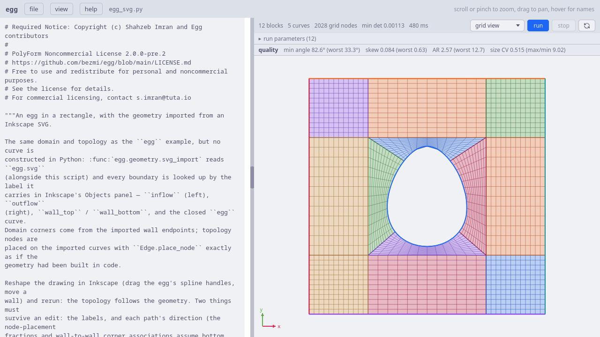
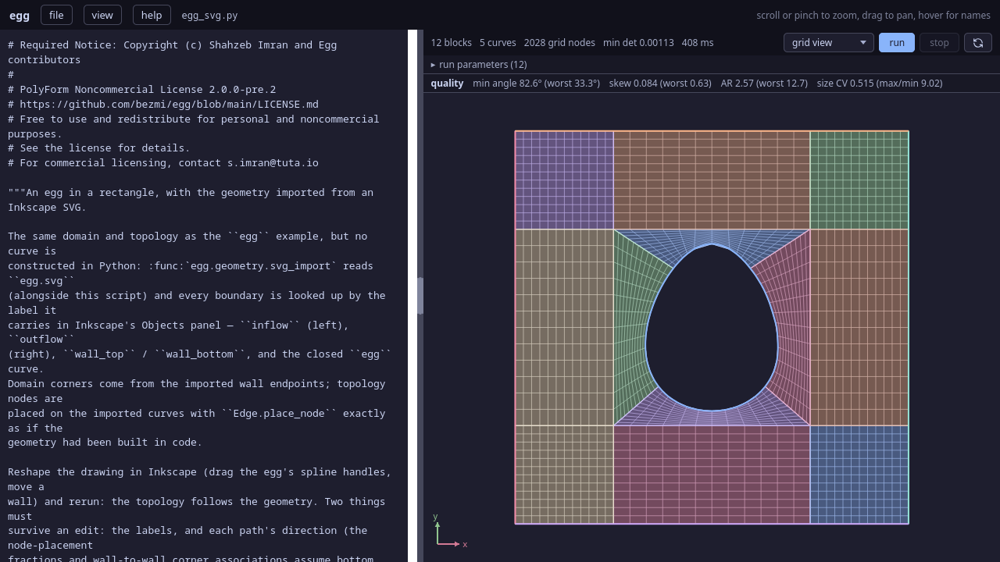
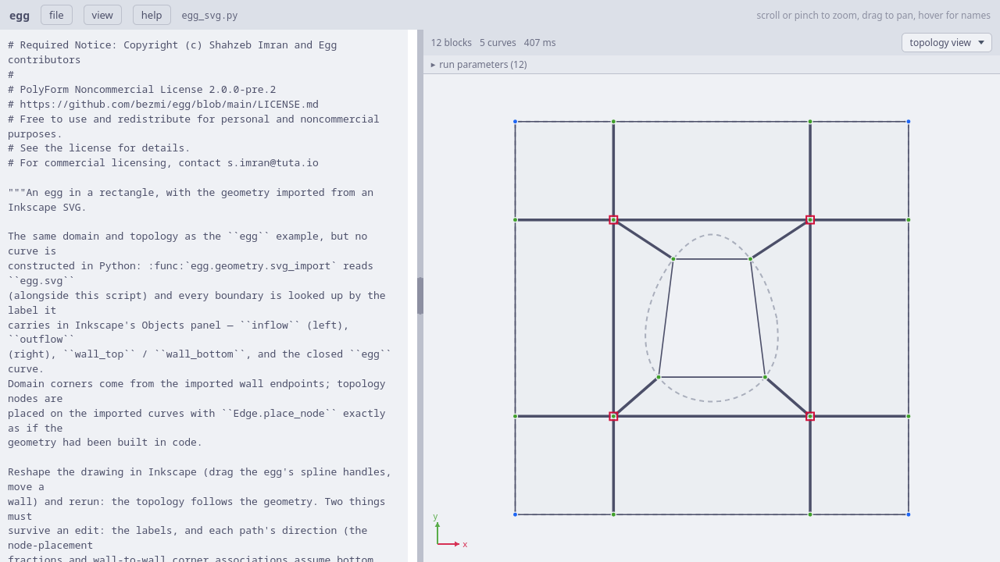
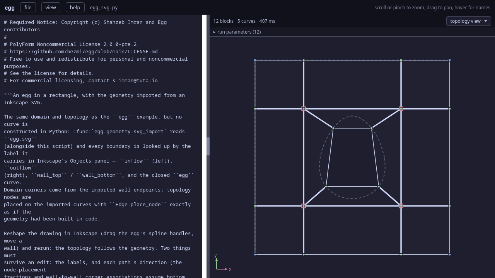

.. Required Notice: Copyright (c) Shahzeb Imran and Egg contributors
   PolyForm Noncommercial License 2.0.0-pre.2
   https://github.com/bezmi/egg/blob/main/LICENSE.md

The ``egg-svg`` example
=======================

The same egg-in-rectangle O-grid as :doc:`the egg example <egg>` — but this
time **nothing is drawn in Python**. Both the geometry *and* the block
layout are read from an Inkscape SVG: the curves come from labelled paths,
and the twelve O-grid blocks are inferred from a straight-line wireframe on
a ``topology`` layer. Reshape the drawing in Inkscape and rerun, and the
mesh follows.

   The egg-svg example in the web UI (grid view), at TFI initialisation. It
   is the egg example's O-grid — ring, edge blocks, corner blocks — but the
   egg curve and the block corners were drawn in Inkscape, not code.

   The egg-svg example in the web UI (grid view), at TFI initialisation. It
   is the egg example's O-grid — ring, edge blocks, corner blocks — but the
   egg curve and the block corners were drawn in Inkscape, not code.

Because the mesh it produces is the egg example's, this tutorial does not
re-explain the O-grid — read :doc:`egg` for the block structure, the
sliding nodes, and the singularities. What is new is the **import path**:
two functions, :func:`~egg.geometry.svg2d.svg_import` and
:func:`~egg.geometry.svg2d.svg_topology`, that replace the entire
hand-written ``build_egg_in_rectangle``. The file is
``examples/2D/egg-svg/egg_svg.py`` with the drawing in ``egg.svg`` alongside
it. We start at the web-UI guard.

The web UI entry point
----------------------

.. code-block:: python

   if __name__ == "__egg_webui__":  # running inside the egg web UI
       import egg.webui as egg_webui

       # CLI defaults, mirroring driver.py — edit freely
       a = egg_webui.params(
           # Uniform cells per block axis, inferred wholly from the SVG blocking
           # (editable() surfaces it as a numeric box in the run panel).
           res=egg_webui.editable(12, label="resolution"),
           # editable() surfaces a value in the run panel with a typed input;
           # choices=[...] renders a dropdown. metric="shape" is the classic
           # scale-invariant metric; "shape_size" also equalises cell areas.
           metric=egg_webui.editable("shape_size", choices=["shape", "shape_size"]),
           bl_first_height=5.0e-3,
           bl_growth=1.5,
           pin_layers=2,
           pin_sweeps=300,
           sweeps_per_delta=20,
           tmop_sweeps=600,
           chunk=50,
           smoother="jacobi",
           omega=0.8,
           device="cpu",
       )
       topo, ents, grid, cfg = setup(a)
       egg_webui.run(grid, generate_steps(grid, config=cfg, untangle_direct=False))

Two knobs use :func:`egg_webui.editable`:

- ``res=egg_webui.editable(12, label="resolution")`` — a numeric box. This
  is the single uniform cells-per-axis count for **every** block; a shared
  value keeps all the SVG-inferred interfaces conforming.
- ``metric=egg_webui.editable("shape_size", choices=[...])`` — the metric
  dropdown, as in the capsule examples.

.. note::

   ``res`` and ``metric`` are **web-UI-only** knobs. Unlike the capsule
   examples, ``driver.py`` here defines no ``--res`` or ``--metric`` flag,
   so on the command line they fall back to their defaults (``res=12`` and
   ``metric="shape"``) via ``a.get(...)`` in :func:`setup`. The dropdown
   and numeric box exist only because ``editable`` marks the literals in
   the guard block for the panel.

``setup``: knobs to pipeline
----------------------------

.. code-block:: python

   def setup(a):
       topo, ents = build_egg_from_svg(
           bl_first_height=a["bl_first_height"],
           bl_growth=a["bl_growth"],
           n_fixed=a["pin_layers"],
           res=a.get("res", 12),
       )

       pin = a["bl_first_height"] > 0.0 and a["pin_layers"] > 0
       grid = topo.initialize_grid()
       metric = a.get("metric", "shape")
       cfg = PipelineConfig(
           sweeps_per_delta=a["sweeps_per_delta"],
           tmop_sweeps=a["tmop_sweeps"],
           tmop_chunk=a["chunk"],
           tmop_smoother=a["smoother"],
           tmop_metric=metric,
           cluster_boundary_layers=pin,
           bl_blend_neighbours=False,
           omega=a["omega"],
           device=a["device"],
           pin_sweeps=a["pin_sweeps"] if pin else 0,
           respace=a["bl_first_height"] > 0.0 and not pin,
       )
       return topo, ents, grid, cfg

This ``setup`` is a blend of the two you have already seen. It uses the egg
example's ``bl_blend_neighbours=False`` (confine the clustering profile to
the O-ring, whose neighbours are too coarse to carry it), *and* the capsule
examples' ``tmop_metric`` (which the pipeline forwards to the auto-built
target so ``shape_size`` sizes its far-field default to the grid). The
pin/respace regimes are the egg example's, selected by
``cluster_boundary_layers``: clustering + pinning by default, clustering +
respace with ``--pin-layers 0``, or no clustering with
``--bl-first-height 0``. All of that is covered in the earlier tutorials;
the interesting line is the first one, ``build_egg_from_svg``.

``build_egg_from_svg``: geometry and blocking from the drawing
--------------------------------------------------------------

.. code-block:: python

   SVG_FILE = Path(__file__).resolve().parent / "egg.svg"

   def build_egg_from_svg(bl_first_height=0.0, bl_growth=1.5, n_fixed=2, res=12):
       dom = svg_import(SVG_FILE)
       b, entities = svg_topology(dom, res=res)

       if bl_first_height > 0.0:
           b.set_boundary_layer(
               dom.edge("egg"),
               first_height=bl_first_height,
               growth=bl_growth,
               n_fixed=n_fixed,
           )

       return b.build(), entities

Four lines replace the whole of the egg example's geometry-and-topology
code. Two functions do the work.

Importing the geometry
^^^^^^^^^^^^^^^^^^^^^^^

:func:`~egg.geometry.svg2d.svg_import` parses the SVG into labelled
geometry entities, addressed by the label each path carries in Inkscape's
Objects panel:

- ``dom["egg"]`` is the raw entity, ``dom.edge("egg")`` wraps it as an
  :class:`~egg.geometry.frontend2d.Edge` for node placement, and
  ``dom.all("wall")`` collects same-labelled pieces.
- SVG is y-down; ``svg_import`` flips it into egg's y-up model space by
  default (so the drawing looks the same as it does in Inkscape).

The boundaries here carry the same physical names as the egg example —
``inflow`` (left), ``outflow`` (right), ``wall_top`` / ``wall_bottom``, and
the closed ``egg`` curve.

Inferring the blocking
^^^^^^^^^^^^^^^^^^^^^^^

:func:`~egg.geometry.svg2d.svg_topology` is the part with no analogue in
the other examples. A dedicated ``topology`` layer in the SVG holds a
straight-line **wireframe** whose endpoints are the block corners; the
function turns its planar-graph faces into blocks:

- coincident wireframe endpoints **weld** into shared corners, so
  interfaces stay conforming;
- the outer face and the region *inside* the closed egg curve (what the
  grid wraps *around*) are dropped; every other quad becomes a block;
- a wireframe edge whose **both** ends lie on a labelled curve is
  associated to that curve and inherits its label as a boundary tag — a
  straight schematic edge is allowed to follow a curved boundary,
  ICEM-style;
- a corner lying on two or more curves is pinned, on one curve slides, on
  none is free;
- **singularities emerge on their own** — they are just the wireframe nodes
  of irregular degree. The four 5-valent corners of this O-grid are exactly
  the nodes where five wireframe edges cross; nothing about them is
  authored.

It returns a populated :class:`~egg.topology.builder.TopologyBuilder` (not
yet built) plus the ``{label: entity}`` dict, so the script can still attach
a boundary layer before calling ``build``. The entities come pre-named from
their SVG labels, so those same labels flow through the associations into the
built topology's derived :attr:`topology.entities` map and become the SU2
boundary markers — the returned ``entities`` dict and ``topology.entities``
agree by construction.

.. code-block:: python

   b.set_boundary_layer(
       dom.edge("egg"),
       first_height=bl_first_height, growth=bl_growth, n_fixed=n_fixed,
   )

The clustering is requested on the *imported* egg curve, exactly as the egg
example requested it on the code-built curve — ``set_boundary_layer`` does
not care where the entity came from. ``relax_orthogonality`` is left empty:
the egg is a closed interior wall, so no domain boundary meets it obliquely.

   Topology view: the twelve-block O-grid, inferred entirely from the SVG
   wireframe. The four red boxes are the 5-valent singularities where five
   wireframe edges cross — identical in structure to the code-built egg
   example.

   Topology view: the twelve-block O-grid, inferred entirely from the SVG
   wireframe. The four red boxes are the 5-valent singularities where five
   wireframe edges cross — identical in structure to the code-built egg
   example.

What must survive an edit
^^^^^^^^^^^^^^^^^^^^^^^^^^

The whole point is that you can reshape the drawing — drag the egg's spline
handles, move a wall, or drag a blocking node to shift a singularity — and
rerun, and the topology follows the geometry. Two things have to survive an
edit for that to keep working:

- **the labels** — the boundary lookup is by Inkscape label, so ``egg`` /
  ``inflow`` / ``outflow`` / ``wall_top`` / ``wall_bottom`` must stay named;
- **each path's direction** — the node-placement fractions and the
  wall-to-wall corner associations assume a specific traversal of each wall
  (bottom west→east, right south→north, top east→west, left south→north in
  model space).

The pipeline
------------

From here on the pipeline is identical to the egg example — ``init`` →
``untangle`` (if folded) → ``tmop`` → ``pin`` + ``tmop`` (or ``respace``) →
``final`` — with the metric threaded through as ``tmop_metric``. The grid it
relaxes is the egg-in-rectangle O-grid; the only difference from the egg
example is that ``res`` sets a single uniform cell count per block axis
(rather than the per-block resolutions the code-built version chooses),
which is what keeps every SVG-inferred interface conforming.

Running it from the command line
--------------------------------

.. code-block:: python

   def main():
       ...
       a = parse_args()
       topo, ents, grid, cfg = setup(vars(a))
       steps = generate_steps(grid, config=cfg, untangle_direct=not a.plot_live)
       finish(grid, topo, ents, steps, a,
              title="egg in rectangle (from Inkscape SVG)",
              mindet_title="min det A (TMOP only)")

The same ``parse_args`` → ``setup`` → ``generate_steps`` → ``finish``
sequence as the egg example, with the same plotting and boundary-layer
flags (``--bl-first-height`` / ``--bl-growth`` / ``--pin-layers`` /
``--pin-sweeps``) — the clustering attaches to the imported curve just the
same. Recall that ``--res`` and ``--metric`` are not CLI flags here; those
two are web-UI knobs only. Run ``uv run egg_svg.py --help`` for the rest.

A few things to try
-------------------

- **Open ``egg.svg`` in Inkscape**, drag one of the egg's spline handles or
  a blocking node, save, and rerun — the mesh tracks your edit.
- In the web UI, raise or lower the **resolution** box and re-render; every
  block refines together, interfaces staying conforming.
- ``--plot-topology`` overlays the inferred block skeleton on the dimmed
  geometry — the clearest way to see that the wireframe became the O-grid.
- Compare against :doc:`egg`: the two produce the same mesh, one from code
  and one from a drawing.
