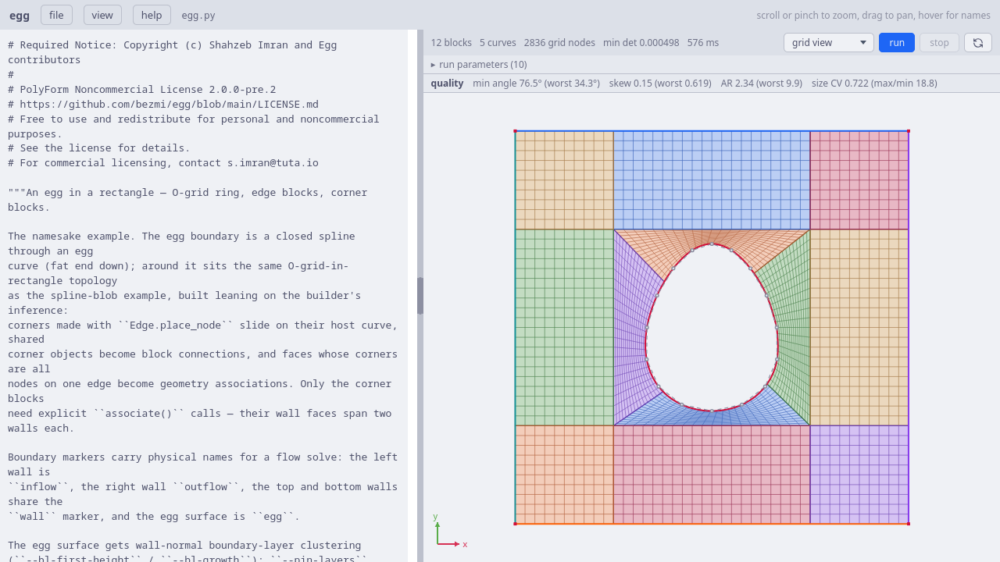
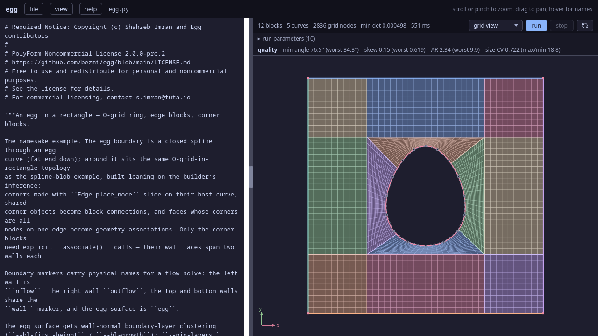
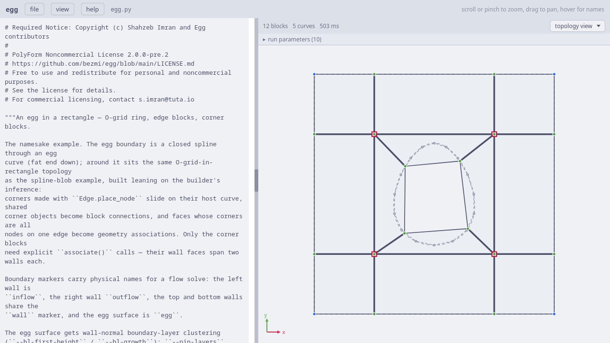
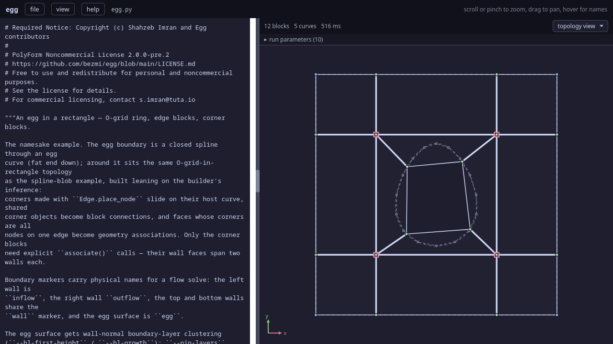

.. Required Notice: Copyright (c) Shahzeb Imran and Egg contributors
   PolyForm Noncommercial License 2.0.0-pre.2
   https://github.com/bezmi/egg/blob/main/LICENSE.md

The ``egg`` example
===================

The namesake example: a closed egg-shaped curve sitting inside a 4×4
square, meshed with an **O-grid**. A ring of four blocks hugs the egg, four
*edge* blocks bridge the ring out to the four domain walls, and four
*corner* blocks fill the diagonals — twelve blocks in all. The egg surface
carries wall-normal boundary-layer clustering, and the whole grid is
relaxed by the untangle + TMOP pipeline.

   The egg example in the web UI (grid view), at TFI initialisation before
   smoothing: the O-ring wrapping the egg, four edge blocks reaching out to
   the domain walls, and four corner blocks — twelve blocks, tinted per
   block.

   The egg example in the web UI (grid view), at TFI initialisation before
   smoothing: the O-ring wrapping the egg, four edge blocks reaching out to
   the domain walls, and four corner blocks — twelve blocks, tinted per
   block.

The file is ``examples/2D/egg/egg.py`` (with argument parsing split into a
sibling ``driver.py``). It has three moving parts:

- :func:`build_egg_in_rectangle` — declares the geometry and the rough
  block topology;
- :func:`setup` — turns a dict of knobs into a grid, a
  :class:`~egg.pipeline.PipelineConfig`, and a TMOP target;
- two entry-point guards at the bottom — one for the web UI, one for the
  command line.

Most people first meet the example through the web UI, so we start where
the UI does: the ``__egg_webui__`` guard at the foot of the file, and walk
*outward* from there into the functions it calls.

The web UI entry point
----------------------

The web UI executes a script with ``__name__ == "__egg_webui__"`` — the
mirror image of the usual ``__main__`` guard, so this block runs *only*
inside the UI and is skipped on the command line:

.. code-block:: python

   if __name__ == "__egg_webui__":  # running inside the egg web UI
       import egg.webui as egg_webui

       # CLI defaults, mirroring driver.py — edit freely
       a = egg_webui.params(
           bl_first_height=5.0e-3,
           bl_growth=1.5,
           pin_layers=2,
           pin_sweeps=300,
           sweeps_per_delta=20,
           tmop_sweeps=600,
           chunk=50,
           smoother="jacobi",
           omega=0.8,
           device="cpu",
       )
       topo, ents, grid, cfg = setup(a)
       egg_webui.run(grid, generate_steps(grid, config=cfg, untangle_direct=False))

``a`` is the **knob panel**. Every value is a plain Python literal, and the
UI's *run parameters* strip is a live form over exactly this dict: numbers
become numeric boxes, and the ``smoother`` and ``device`` keys become
dropdowns. Editing a field rewrites only that one literal in the script
source, so the code stays the single source of truth (see the
:doc:`../webui` for the details). The values here mirror ``driver.py``'s
CLI defaults, so a UI run and a bare command-line run do the same thing.

.. note::

   The egg example uses plain literals, which the panel picks up
   automatically. When you want a dropdown for a value the panel does not
   special-case, or a nicer field label, wrap the literal in
   ``egg_webui.editable(value, choices=[...], label=...)`` — an identity
   function at runtime that the panel keys off of. The
   ``capsule-fire-II`` and ``egg-svg`` examples use it for their
   ``metric`` selector.

The last two lines are the contract with the UI:

- :func:`setup` consumes the knob dict and returns everything the pipeline
  needs — the topology ``topo``, a dict of named geometry ``ents`` (for
  drawing the curves), the TFI-initialised ``grid``, the config ``cfg``,
  and the TMOP ``target``.
- :func:`egg_webui.run` hands the UI the grid and an **unconsumed**
  :func:`~egg.pipeline.generate_steps` generator. Nothing computes yet —
  the generator is registered and only advances when you press **run**.

``untangle_direct=False`` asks the untangle phase to yield after each
δ-continuation step, so the live view can animate the grid unfolding
frame by frame (the command-line path runs it in one shot instead — see
`Running it from the command line`_).

``setup``: from knobs to a runnable pipeline
--------------------------------------------

:func:`setup` is shared by both entry points — the UI passes the knob dict
above, and ``main()`` passes ``vars(args)`` from the argument parser, so
the two never drift.

.. code-block:: python

   def setup(a):
       topo, ents = build_egg_in_rectangle(
           bl_first_height=a["bl_first_height"],
           bl_growth=a["bl_growth"],
           n_fixed=a["pin_layers"],
       )

       pin = a["bl_first_height"] > 0.0 and a["pin_layers"] > 0
       grid = topo.initialize_grid()
       cfg = PipelineConfig(
           sweeps_per_delta=a["sweeps_per_delta"],
           tmop_sweeps=a["tmop_sweeps"],
           tmop_chunk=a["chunk"],
           tmop_smoother=a["smoother"],
           cluster_boundary_layers=pin,
           bl_blend_neighbours=False,
           omega=a["omega"],
           device=a["device"],
           pin_sweeps=a["pin_sweeps"] if pin else 0,
           respace=a["bl_first_height"] > 0.0 and not pin,
       )
       return topo, ents, grid, cfg

Building the topology comes first (next section). The rest of ``setup``
decides *how the wall spacing is enforced*, and there are three regimes,
selected by two knobs:

- **clustering + pinning** (``bl_first_height > 0`` and ``pin_layers >
  0`` — the default): ``pin`` is true, so ``cluster_boundary_layers`` is
  on. TMOP smooths against a boundary-layer *target* (below), then the
  first ``pin_layers`` rows are frozen at their exact geometric heights and
  ``pin_sweeps`` more sweeps re-settle the grid above them.
- **clustering + respacing** (``bl_first_height > 0`` but ``pin_layers ==
  0``): clustering off — TMOP runs on the plain shape metric, and a single
  exact wall-respacing post-pass at the end (``respace=True``) restores the
  requested spacing.
- **no clustering** (``bl_first_height == 0``): ``cluster_boundary_layers``
  is false, ``pin_sweeps`` is 0 and ``respace`` is false; the pipeline is a
  plain untangle + shape smooth.

When ``pin`` is set, the pipeline builds the target itself from the
boundary-layer spec recorded on the topology (via
:func:`~egg.smoothing.targets.build_topology_target`), producing a per-block
aspect-ratio target: near the egg the target cells are short in the
wall-normal direction (the requested ``first_height`` growing by
``bl_growth`` per row) and stretched tangentially. ``bl_blend_neighbours``
is turned **off** deliberately:

.. code-block:: python

   # bl_blend_neighbours would continue the clustering profile into the
   # blocks behind the O-ring — they are far too coarse to carry it
   # and get dragged toward the mid square. Confine the profile to
   # the ring; the ring's outer rows reach the neighbour spacing on
   # their own.
   cluster_boundary_layers=pin,
   bl_blend_neighbours=False,

With blending on, a wall block's clustering profile is continued across
the shared interface into the block behind it; here that block is the
coarse edge/corner block, which cannot represent the steep near-wall
profile and would be pulled toward the mid square. Confining the profile to
the O-ring keeps it well resolved.

.. note::

   Notice the target is built *before*
   :meth:`~egg.topology.block_topology.BlockTopology.initialize_grid`.
   That ordering is fine here because the plain shape
   metric's far-field default target (:func:`~egg.smoothing.targets.IdentityTarget`)
   needs no grid to construct. Under the size-aware ``shape_size`` metric
   the default has to carry physical scale and *does* need the grid, which
   forces the opposite order — the ``capsule-phoebus`` example shows that
   variant.

Finally :meth:`topo.initialize_grid()
<egg.topology.block_topology.BlockTopology.initialize_grid>` fills every
block with a transfinite-interpolation (TFI) starting mesh, snapping the
constrained faces onto their curves. That is the folded-or-not grid the
pipeline will relax.

``build_egg_in_rectangle``: geometry and topology
-------------------------------------------------

This is where the mesh is actually *described*. egg's front-end separates
two things: **geometry** (the curves the mesh must lie on) and **topology**
(how blocks tile the domain and which faces stick to which curves). The
function builds the geometry first, then declares the blocks, leaning
heavily on the builder's ability to *infer* connections and curve
associations from shared corner objects.

The egg boundary
^^^^^^^^^^^^^^^^^

.. code-block:: python

   # Egg boundary: closed spline through an egg curve, fat end down.
   theta = np.linspace(0.0, 2.0 * np.pi, 17)[:-1]
   ring = [
       Vector3(2.0 + (0.66 - 0.15 * np.sin(t)) * np.cos(t), 2.0 + 0.85 * np.sin(t))
       for t in theta
   ]
   egg = Edge(Spline(ring, closed=True), name="egg")

Sixteen points are sampled around a parametric egg curve centred on
``(2, 2)``. The ``0.66 - 0.15 * np.sin(t)`` factor modulates the horizontal
radius so the curve is narrower at the top (``sin t > 0``) and fatter at
the bottom — the "fat end down" egg. ``linspace(..., 17)[:-1]`` drops the
duplicated endpoint so the sample is not repeated.

:func:`~egg.geometry.frontend2d.Spline` fits a natural cubic spline through
those points; ``closed=True`` appends the first point to the end so the
curve wraps (a C0 joint, gdtk-style — not a periodic spline). Wrapping it
in an :class:`~egg.geometry.frontend2d.Edge` re-parameterises the curve
over a normalized ``t ∈ [0, 1]``, which is what lets us place topology
nodes on it by fraction.

``name="egg"`` is the curve's single source of truth: it is the key under
which the entity appears in ``topology.entities`` (so the visualiser draws
it), and it doubles as the entity's export ``tag`` — the physical marker
stamped on every face that ends up associated with this curve. Naming a
curve once is all it takes; the association machinery carries both the
geometry constraint and the marker from there.

The domain walls and the sliding nodes
^^^^^^^^^^^^^^^^^^^^^^^^^^^^^^^^^^^^^^^

.. code-block:: python

   # Domain walls and the sliding nodes that split them. Naming each curve
   # auto-derives its SU2 marker on every associated face. The top and bottom
   # walls are named distinctly (so both draw) but carry tag="wall", so they
   # export under one shared 'wall' marker — no per-face tag_boundary needed.
   sw, se = Vector3(0, 0, fixed=True), Vector3(4, 0, fixed=True)
   ne, nw = Vector3(4, 4, fixed=True), Vector3(0, 4, fixed=True)
   bottom = Edge(Line(p0=sw, p1=se), name="wall_bottom", tag="wall")
   right = Edge(Line(p0=se, p1=ne), name="outflow")
   top = Edge(Line(p0=ne, p1=nw), name="wall_top", tag="wall")
   left = Edge(Line(p0=sw, p1=nw), name="inflow")
   bsw, bse = bottom.place_node(0.25), bottom.place_node(0.75)
   rse, rne = right.place_node(0.25), right.place_node(0.75)
   tne, tnw = top.place_node(0.25), top.place_node(0.75)
   lnw, lsw = left.place_node(0.75), left.place_node(0.25)

The four corners of the square are :class:`~egg.geometry.frontend2d.Vector3`
points marked ``fixed=True`` — they will never move during smoothing. The
four walls are :class:`~egg.geometry.frontend2d.Edge`-wrapped straight
:class:`~egg.geometry.frontend2d.Line`\ s, and each is *named* — the name is
again the single source of truth for both drawing and the boundary marker.
The left wall is ``inflow`` and the right is ``outflow``. The top and bottom
walls want a common physical marker but must stay distinct entities so both
draw, so they are named apart (``wall_top`` / ``wall_bottom``) but given the
same ``tag="wall"``: ``tag`` is the export marker (it defaults to the name),
and setting it explicitly folds the two walls under one ``wall`` marker
without merging their identities. There is no ``tag_boundary`` call anywhere
below — :meth:`~egg.topology.builder.TopologyBuilder.build` auto-derives each
face's marker from the tag of the entity it associates with.

Each wall is then split at its quarter and three-quarter points with
:meth:`~egg.geometry.frontend2d.Edge.place_node`. A ``place_node`` call
returns a :class:`~egg.geometry.frontend2d.Node`: a point that behaves like
any corner but *remembers the edge it lives on*. Because it is not fixed, a
node is free to **slide along its wall** during smoothing while staying on
the wall — that is how the mesh redistributes its boundary spacing without
leaving the geometry. The names follow the wall and the nearby corner:
``bsw`` is on the ``bottom`` wall near the ``sw`` corner (fraction 0.25),
``bse`` near ``se`` (0.75), and so on. The parameter runs along each edge's
own direction, which is why ``left`` (built ``sw → nw``) takes ``lsw`` at
0.25 and ``lnw`` at 0.75.

The remembered edge matters later: when a block face has *all* its corners
sitting on the same curve, the builder can infer that the face should stick
to that curve, with no explicit call needed.

The O-ring inner corners and the mid square
^^^^^^^^^^^^^^^^^^^^^^^^^^^^^^^^^^^^^^^^^^^^

.. code-block:: python

   # O-ring inner corners slide on the egg itself; mid square ties the
   # ring to the outer blocks.
   ine, inw, isw, ise = (egg.place_node(f) for f in (0.125, 0.375, 0.625, 0.875))
   msw, mse, mne, mnw = (Vector3(*p) for p in [(1, 1), (3, 1), (3, 3), (1, 3)])

Four nodes are placed on the egg curve at fractions ``0.125, 0.375, 0.625,
0.875`` — evenly spaced, offset by an eighth so they land at the seams
*between* the four ring blocks rather than on their centres. These are the
ring's inner corners, and like the wall nodes they slide (here, along the
egg).

The four *mid-square* corners at ``(1,1), (3,1), (3,3), (1,3)`` are plain
``Vector3``\ s — not fixed and not on any curve, so they are fully free
interior corners. The mid square is the seam where the O-ring meets the
outer blocks.

Declaring the blocks
^^^^^^^^^^^^^^^^^^^^^

.. code-block:: python

   b = TopologyBuilder(d=2)

A :class:`~egg.topology.builder.TopologyBuilder` collects corners, blocks,
associations and boundary tags; :meth:`~egg.topology.builder.TopologyBuilder.build`
validates and finalises them at the end. Blocks are declared in the
**compass form** ``add_block(name, sw=, nw=, se=, ne=, res=...)``, where
``res`` is the per-axis cell count. The builder deduplicates corner objects
by identity — passing the *same* Python object as a corner of two blocks is
what tells it the two blocks share that corner (and, by extension, the face
between them).

The O-ring
""""""""""

.. code-block:: python

   # O-ring around the egg; inner-face association with the egg is inferred.
   for nm, c_sw, c_nw, c_se, c_ne in [
       ("o_s", msw, isw, mse, ise),
       ("o_e", mse, ise, mne, ine),
       ("o_n", mne, ine, mnw, inw),
       ("o_w", mnw, inw, msw, isw),
   ]:
       # Clustering needs the ring deep enough to carry the layer profile:
       # a shallow ring forces the steep part of the target across the
       # mid-square interface, which folds cells there (measured).
       o_res_j = 16 if bl_first_height > 0.0 else 8
       b.add_block(nm, sw=c_sw, nw=c_nw, se=c_se, ne=c_ne, res=(20, o_res_j))
       # inner face on the egg: association inferred, marker 'egg' auto-derived.

Four blocks wrap the egg. For each, the ``sw``/``se`` corners are on the
mid square and the ``nw``/``ne`` corners are on the egg, so **axis 1**
(``sw → nw``) runs *outward-to-inward*, from the mid square down onto the
egg. The high side of axis 1 — face ``(axis=1, side=1)`` — is therefore the
edge lying on the egg. Two facts about that face fall out automatically:

- Both of its corners are nodes placed on the ``egg`` edge, so
  :meth:`~egg.topology.builder.TopologyBuilder.build` **infers** the
  association to the egg curve — no ``associate`` call is written.
- Adjacent ring blocks share the ``ise``/``ine``/… node objects, so the
  ring's internal connections are inferred too.

Nothing else is written for that face. Because the association is inferred
*and* the egg entity carries a marker (its ``tag``, defaulting to the name
``egg``), ``build`` auto-derives the physical ``egg`` marker on that face for
export — there is no ``tag_boundary`` call.

``res=(20, o_res_j)`` gives 20 cells *around* the egg (axis 0, tangential)
and ``o_res_j`` cells across the ring (axis 1, wall-normal). The ring is
deepened from 8 to **16** rows when clustering is on: a shallow ring would
force the steep part of the boundary-layer target across the mid-square
interface, which folds cells there — this was measured, not guessed.

The edge blocks
"""""""""""""""

.. code-block:: python

   # Edge blocks between walls and mid square; wall associations inferred, so
   # every marker (inflow / outflow / wall) auto-derives from the named edges.
   for nm, c_sw, c_nw, c_se, c_ne in [
       ("e_s", bsw, msw, bse, mse),
       ("e_e", rse, mse, rne, mne),
       ("e_n", tne, mne, tnw, mnw),
       ("e_w", lnw, mnw, lsw, msw),
   ]:
       b.add_block(nm, sw=c_sw, nw=c_nw, se=c_se, ne=c_ne, res=(20, 10))

Four blocks bridge each wall out to the mid square. Take ``e_s``: its
``sw``/``se`` corners (``bsw``, ``bse``) are the sliding nodes on the
``bottom`` wall, and its ``nw``/``ne`` corners (``msw``, ``mse``) are on
the mid square. So the low side of axis 1 — face ``(1, 0)`` — lies on the
bottom wall. As with the ring, both corners of that face are nodes on the
same edge, so the wall association is inferred — and with it the boundary
marker, since each wall carries its own tag. The loop no longer names a
marker per block: the markers ride in on the named edges, ``inflow`` from
the left wall, ``outflow`` from the right, and ``wall`` from both the top
and bottom (whose shared ``tag="wall"`` collapses them onto one marker).

The corner blocks
"""""""""""""""""

.. code-block:: python

   # Corner blocks: two walls meet at each, so associations stay explicit;
   # markers auto-derive from the edges' tags (wall_top/wall_bottom -> 'wall').
   for nm, w0, w1, c_sw, c_nw, c_se, c_ne in [
       ("c_sw", left, bottom, sw, lsw, bsw, msw),
       ("c_se", bottom, right, se, bse, rse, mse),
       ("c_ne", right, top, ne, rne, tne, mne),
       ("c_nw", top, left, nw, tnw, lnw, mnw),
   ]:
       b.add_block(nm, sw=c_sw, nw=c_nw, se=c_se, ne=c_ne, res=(10, 10))
       b.associate(nm, 0, 0, w0)
       b.associate(nm, 1, 0, w1)

The four corner blocks fill the diagonals, and they are the one case where
association inference does *not* fire. Each corner block has **two** faces
on the domain boundary — one on each of the two walls meeting at that
corner — and those two faces meet at the fixed domain corner (``sw``,
``se``, …). That corner is a plain fixed ``Vector3``, not a node placed on
either curve, so neither wall face has *all* its corners as nodes on one
edge, and the inference rule declines. So both associations are written out
explicitly with :meth:`~egg.topology.builder.TopologyBuilder.associate`:
face ``(0, 0)`` onto the first wall, face ``(1, 0)`` onto the second. The
markers, though, still take care of themselves — each associated wall
carries its tag, so ``build`` derives the right marker (``inflow`` /
``outflow`` / ``wall``) for each face with no ``tag_boundary`` needed.

Boundary-layer clustering
^^^^^^^^^^^^^^^^^^^^^^^^^^

.. code-block:: python

   if bl_first_height > 0.0:
       # Wall-normal clustering on the egg surface; the egg is a closed
       # interior wall, so no domain boundary meets it obliquely and
       # relax_orthogonality stays empty.
       b.set_boundary_layer(
           egg, first_height=bl_first_height, growth=bl_growth, n_fixed=n_fixed
       )

:meth:`~egg.topology.builder.TopologyBuilder.set_boundary_layer` records a
clustering *request* on the egg entity: a first off-wall cell height, a
geometric growth ratio, and ``n_fixed`` — how many near-wall rows to pin
exactly in the pin phase. It does not modify the grid; it stamps a spec
that the pipeline reads back — when ``cluster_boundary_layers`` is set — to
build the clustering target (via
:func:`~egg.smoothing.targets.build_topology_target`), and that the respace
pass reads to enforce the exact spacing. ``relax_orthogonality`` is left empty because
the egg is a *closed interior wall* — no domain boundary crosses it
obliquely (contrast the capsule examples, where the wall meets the outflow
at an angle).

Building the topology
^^^^^^^^^^^^^^^^^^^^^^

.. code-block:: python

   topology = b.build()
   return topology, topology.entities

:meth:`~egg.topology.builder.TopologyBuilder.build` runs the two inference
passes described above — shared corner objects become block-to-block
**connections**, and boundary faces whose corners are all nodes on one edge
become geometry **associations** — auto-derives a boundary marker (each
entity's ``tag``) for every associated face, validates the result (degree of
each DOF, singularities), and returns the finalised
:class:`~egg.topology.block_topology.BlockTopology`.

There is no longer a hand-built ``entities`` dict. ``build`` collects the
entities it saw during association into a **derived** ``{name: entity}`` map
(deduplicated by name — ``wall_top`` and ``wall_bottom`` stay separate keys
even though they share the ``wall`` marker), exposed as the property
:attr:`topology.entities`. The pipeline never needs it, but the visualiser
does — it is the list of curves to draw alongside the mesh — so the function
just returns ``topology.entities`` straight back.

   The same script in **topology view**. The block skeleton makes the
   O-grid explicit: the outer square, the inner mid square, and the four
   ring blocks bridging it to the egg (dimmed, since the geometry only
   constrains a face here). The four **red boxes** are the 5-valent
   singularities — the mid-square corners, where five blocks meet (a ring
   block, two edge blocks, another ring block, and a corner block).

   The same script in **topology view**. The block skeleton makes the
   O-grid explicit: the outer square, the inner mid square, and the four
   ring blocks bridging it to the egg (dimmed, since the geometry only
   constrains a face here). The four **red boxes** are the 5-valent
   singularities — the mid-square corners, where five blocks meet (a ring
   block, two edge blocks, another ring block, and a corner block).

The pipeline
------------

Back in the entry point, :func:`~egg.pipeline.generate_steps` is what
actually relaxes the grid. It is a generator that yields ``(phase, info)``
after each unit of work, so the same code can drive a live animation or a
headless batch run. The phases, in order:

#. ``init`` — the TFI grid, after a boundary snap. Reports the starting
   ``min det``.
#. ``untangle`` — only if the initial grid is *folded* (``min det ≤
   margin``). A δ-continuation relaxes a shifted barrier until every cell
   has positive area. For this egg geometry the TFI start is already
   valid, so this phase is skipped.
#. ``tmop`` — the quality phase, in chunks of ``tmop_chunk`` sweeps. With
   ``smoother="jacobi"`` (the default) these are block-Jacobi sweeps; with
   ``"fas"`` they are nonlinear-multigrid V-cycles. Against a
   boundary-layer target, this pulls the near-egg cells toward the
   requested clustering.
#. ``pin`` + ``tmop`` — with ``pin_sweeps > 0``: the first ``n_fixed``
   rows are respaced to their exact geometric heights and *frozen*, the
   context is rebuilt so those DOFs leave the update set, and
   ``pin_sweeps`` more sweeps re-equilibrate the grid above them.
#. ``respace`` — with ``respace=True`` instead: the exact wall-respacing
   post-pass slides nodes along their smoothed columns to the requested
   spacing.
#. ``final`` — reports the ``min det`` and energy of the finished mesh.

The knobs in ``PipelineConfig`` map straight from the dict: ``tmop_sweeps``
/ ``tmop_chunk`` size the quality phase, ``omega`` is the block-Jacobi SOR
weight, ``device`` selects CPU or GPU, and ``pin_sweeps`` / ``respace`` are
set by ``setup`` according to the regime. See
:class:`~egg.pipeline.PipelineConfig` for the full list.

Run headless with the defaults (here with the sweep counts turned down for
brevity) and the phase trace is exactly this sequence:

.. code-block:: text

   [init]
     min_det=4.9755e-04

   [tmop]
     energy=1.2378e+03 min_det=2.0525e-04 sweeps=50
     energy=9.0962e+02 min_det=2.3461e-04 sweeps=100

   [pin]
     n_dofs=160 min_det=2.7789e-04

   [tmop]
     energy=7.9326e+02 min_det=2.7781e-04 sweeps=50

   [final]
     min_det=2.7781e-04 energy=7.9326e+02

No ``untangle`` line appears — the initial ``min det`` is already positive
— and the ``pin`` line shows 160 DOFs frozen before the second TMOP pass.

Running it from the command line
--------------------------------

The other entry point is the ordinary ``__main__`` guard, which routes
through ``driver.py``:

.. code-block:: python

   def main():
       import os
       import sys

       sys.path.insert(0, os.path.dirname(os.path.abspath(__file__)))
       from driver import finish, parse_args

       a = parse_args()
       topo, ents, grid, cfg = setup(vars(a))
       steps = generate_steps(grid, config=cfg, untangle_direct=not a.plot_live)

       finish(
           grid, topo, ents, steps, a,
           title="egg in rectangle",
           mindet_title="min det A (TMOP only)",
       )

This is the same three-line dance as the UI block — ``parse_args`` builds
the knob namespace, ``setup(vars(a))`` turns it into the pipeline inputs,
and ``generate_steps`` produces the (still unconsumed) generator. The
difference is that ``untangle_direct`` is ``True`` unless you asked for a
live plot: a batch run does the whole δ-continuation in one C++ call, while
``--plot-live`` steps it so the animation can show the unfolding.

``finish`` (in ``driver.py``) then acts on the CLI flags: ``--plot-topology``
short-circuits to a topology drawing before anything runs; ``--plot-live``
animates the pipeline with PyVista; otherwise it drains the generator
headless, prints the per-phase trace above, and optionally draws the final
grid (``--plot-grid``), the convergence curves (``--plot-energy``), or
exports an SU2 mesh (``--export``). Run ``uv run egg.py --help`` for the
full flag list.

A few things to try
-------------------

- ``--bl-first-height 0`` turns clustering off entirely — the egg gets a
  uniform O-grid and you see the "no clustering" regime.
- ``--pin-layers 0`` keeps the clustering but switches from pinning to the
  exact respace post-pass; compare the near-wall spacing of the two.
- ``--smoother fas`` runs the TMOP phase as nonlinear multigrid — the same
  result, faster to converge on large grids.
- ``--plot-topology`` draws just the block skeleton with the singularities
  highlighted, which is the quickest way to see the O-grid structure before
  any smoothing.
