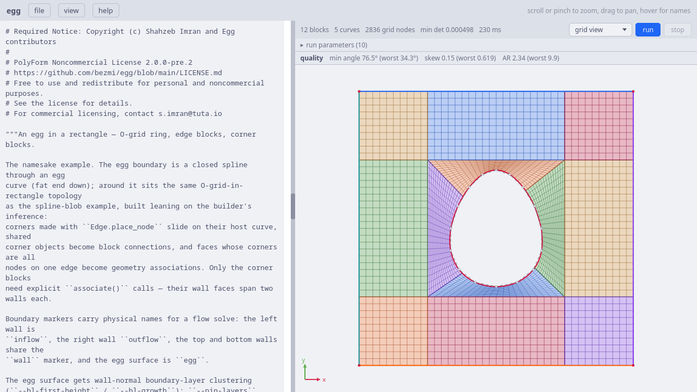
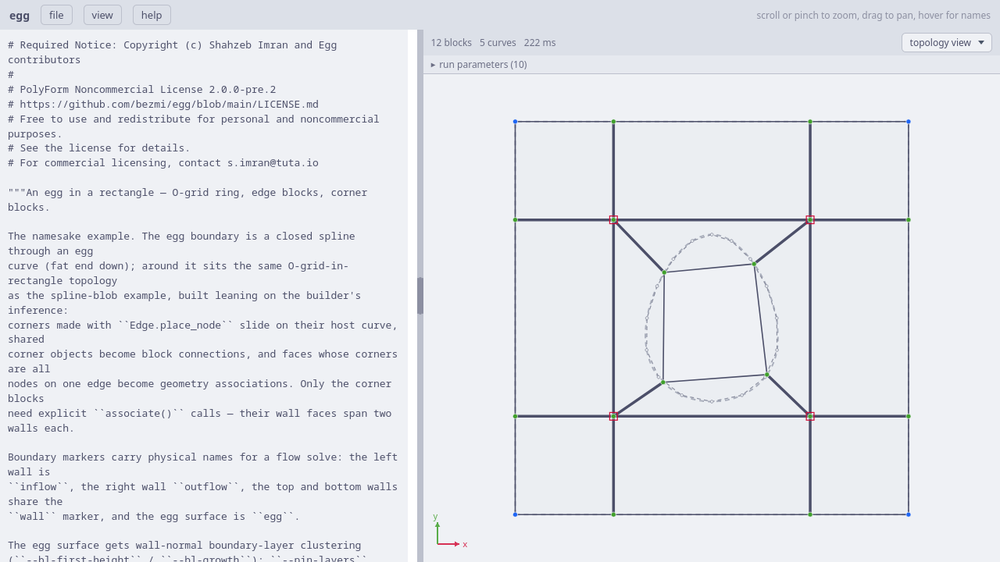
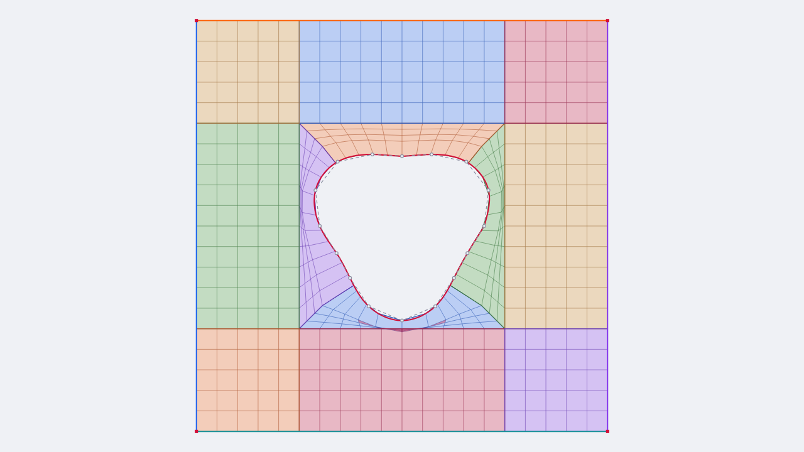
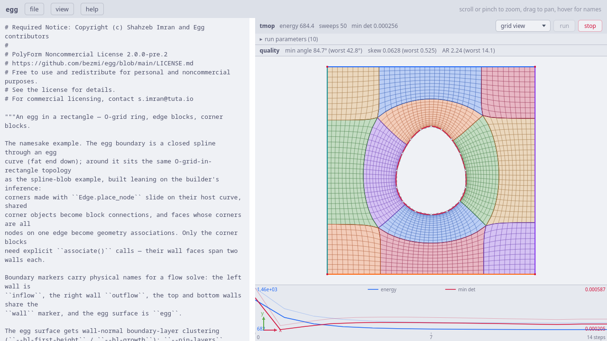
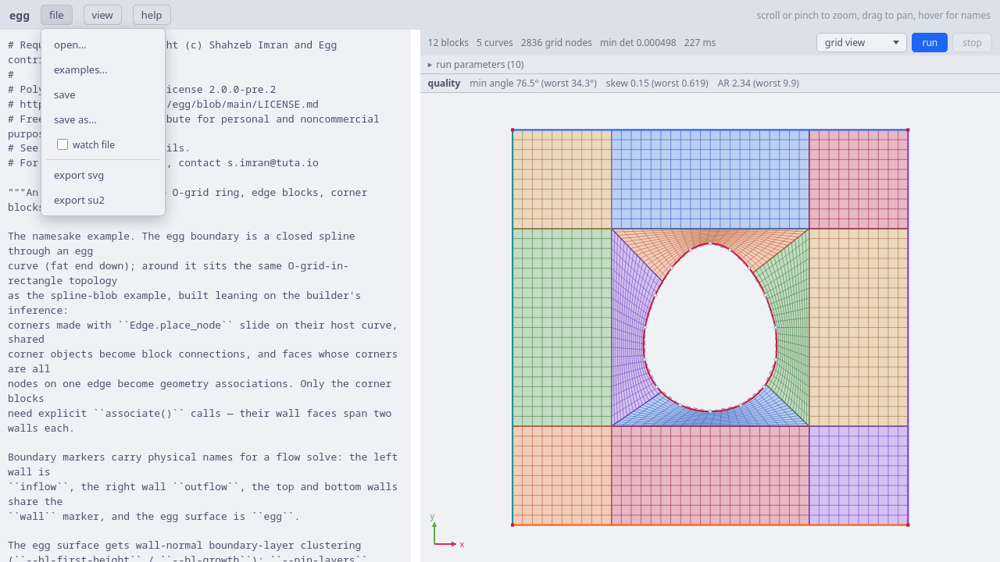
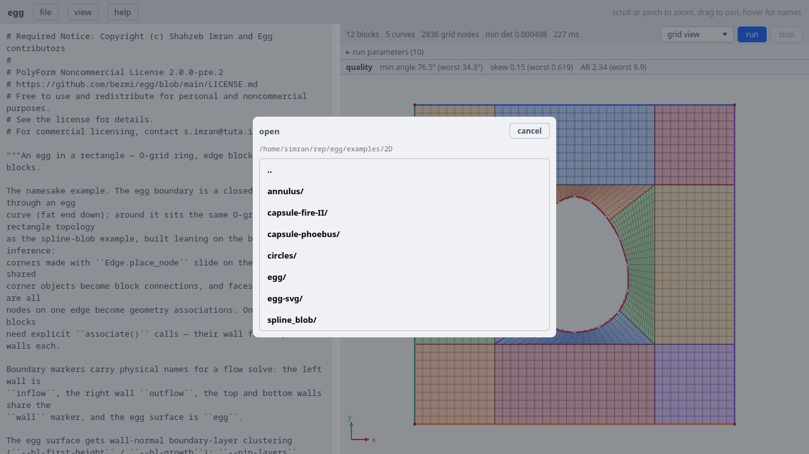
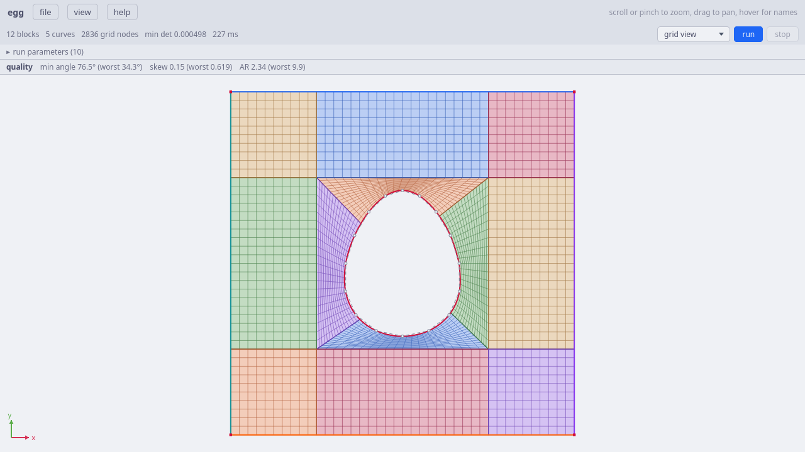
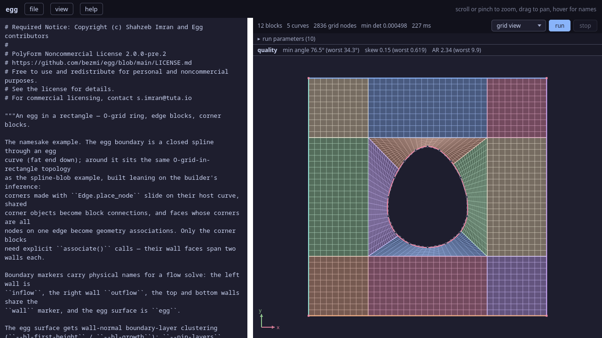

.. Required Notice: Copyright (c) Shahzeb Imran and Egg contributors
   PolyForm Noncommercial License 2.0.0-pre.2
   https://github.com/bezmi/egg/blob/main/LICENSE.md

Web UI tutorial
===============

The web UI is "code as CAD": you write a Python geometry script with the
same egg front-end the examples use, and the browser shows a live render
of whatever the script defines, then runs the real untangle + TMOP
pipeline on it, streaming the relaxing mesh back into the view. You can
write the script in the built-in editor, or keep your own editor and let
the UI follow the file on disk (`Watch mode: use your own editor`_, the
expected day-to-day workflow). It is a local, single-user tool: the
server runs on your machine and scripts execute with full interpreter
privileges.

Starting it
-----------

.. code-block:: bash

   uv sync --group webui            # once; add --group docs for this manual
   uv run --no-sync egg-webui       # → http://127.0.0.1:5001

Useful flags: a positional script path opens it in the editor,
``--host 0.0.0.0`` exposes the server on your network, ``--reload``
restarts on source edits, and ``--no-docs`` skips the docs refresh that
otherwise runs at startup.

The window
----------

   The default view: script on the left, live render on the right.

The left pane is a Python editor (CodeMirror: syntax highlighting,
completions introspected from the real egg API, ``Ctrl-Space`` to
trigger). The right pane re-renders about half a second after you stop
typing; renders execute in a helper process kept warm by the server, so
a script stuck in a loop can't wedge the UI; it is killed after 30
seconds and rendering resumes with your next edit. The bar above the
render shows block/curve/node counts, the
preview ``min det`` (red when the grid is folded), and any warnings;
script errors appear as a traceback with a clickable "error at line N"
chip, and ``print`` output lands in a collapsible *stdout* section.

The view responds to scroll/pinch (zoom) and drag (pan); hover shows
variable names; the coordinate readout at the bottom right reports the
pointer position in geometry coordinates, and **view → fit** resets the
camera. The editor/viewer split is draggable, and the editor font zooms
with ``Ctrl`` + scroll (or a two-finger pinch).

Grid view and topology view
---------------------------

The dropdown in the view bar switches between two renders of the same
script:

- **grid view** is the TFI-initialized (or smoothed) structured grid,
  blocks tinted in pastel colours, folded cells overlaid in red;
- **topology view** is the block skeleton: corners (blue = fixed,
  green = free, red boxes = singular with their valence), connections,
  and the geometry dimmed until it constrains something you select.

In grid view, a **quality** strip under the view bar reports
per-cell statistics over the whole grid: orthogonality (smallest
corner angle, 90° ideal), equiangular skewness (0 ideal), and aspect
ratio, each as mean and worst cell, refreshed about once a second
while a run streams. Clicking a
**block** shows its name and cell counts (``o_s: 20 × 16 cells = 320``);
clicking empty canvas shows the whole grid's total.

   Topology view. Tapping a corner, edge, or block highlights it *and*
   the geometry that will constrain it; the element's name appears at
   the bottom of the view.

The **view** menu also toggles individual layers (grid / tangled /
curves / points / control points) and holds the colour-theme picker
(`Theming`_). **Control points** overlays the
points the geometry was constructed from, CAD-style: spline
through-points joined by dashed chords, Bézier control polygons, arc
radius lines to the centre, clickable like any point. The front-end
retains them as ``Vector3`` attributes (``line.p0``, ``arc.centre``,
``spline.points``), so they show even when the script builds everything
inside functions; SVG-imported geometry has none (those live in
Inkscape).

   The spline-blob example with **view → control points** on.

Editing the topology
--------------------

**edit view** (the third choice in the view dropdown) lets you change the
block layout: split a block into smaller blocks, add and move edges,
attach edges to geometry, and set the number of cells along each edge. The
editor checks your work as you draw, and it changes your script only when
you ask it to.

Editing is off by default. To turn it on, pass an
:class:`~egg.topology.explicit.ExplicitTopology` to the UI and wrap its
``connectivity`` in :func:`~egg.topology.explicit.editable`::

   from egg.topology import ExplicitTopology, editable

   topo = ExplicitTopology(
       base=ring_topology,          # optional starting layout, left unchanged
       geometry={"wall": wall, "far": farfield},   # curves you can attach edges to, by name
       connectivity=editable({
           "nodes": {"a": {"xy": [0, 0]}, "b": {"xy": [1, 0], "on": ["wall"]}},
           "edges": [{"a": "a", "b": "b", "bind": "wall"}],
           "res": 10,
       }),
   )

``editable(...)`` does nothing when the script runs on its own, so the
script still behaves the same outside the UI. It only tells the editor
which part of the file it may change. If a script does not use it — no
:class:`~egg.topology.explicit.ExplicitTopology` at all, or one whose
``connectivity`` isn't wrapped — the edit view still shows the layout, but
the draw tools stay off and a banner under the view bar says editing is
disabled and why. Open ``examples/2D/egg`` for a working example.

The layout is drawn as **nodes** joined by **edges**. In edit view the
normal picture fades into the background, and the nodes and edges are drawn
on top of it. The nodes and edges that come from the script's starting
layout are fixed: you can move or cut them, but you cannot delete them, and
when you drag a node the edges joined to it move with it. Fixed nodes are
blue and free nodes are green, and whatever you have selected is
highlighted. To see what a node or edge is attached to, hold the mouse over
it and read the text at the bottom of the view, such as ``node b · slides
on wall`` (a node from the starting layout is shown there as a *corner*).

There is no separate "draw" mode and "select" mode. What the mouse does
depends on how you use it:

- **click** a node or edge to select it. Click empty space to clear the
  selection.
- **double-click** to start a chain of edges. Each single click after that
  adds another node, joined to the previous one. Double-click again, or
  press **Esc**, to stop.
- **drag** a node or edge to move it. Drag empty space to move the view
  (pan).
- hold **Shift** or **Ctrl** and click to add or remove one item from the
  selection. Hold **Shift** or **Ctrl** and drag to select everything
  inside a box.
- **middle-button drag** always moves the view.
- **right-click** a node you added to rename it.

When you place a new node, the editor attaches it to the nearest thing it
finds, trying these in order:

- an existing node: the new edge joins to it;
- an edge you can edit: the node splits that edge into two;
- an edge from the starting layout: the node cuts it into two edges you can
  edit. The new edges keep the geometry of the original, and you can cut
  them again later;
- a nearby geometry curve: the node sits on the curve and stays on it;
- if nothing is close enough, the node stays where you clicked.

So, to split a block, cut one of its sides and draw an edge across to the
opposite side.

The tools are in the bar on the left. Each tool becomes active only when
your selection fits it:

- **split node** separates one shared node into a separate node for each
  edge that touches it. Select a node where two or more edges meet.
- **join** merges the selected nodes into one. Select two or more nodes
  that you added.
- **coincident** moves the selected node onto the selected edge and splits
  the edge at that spot. Select exactly one node and one edge.
- **set res** sets how many cells lie along the selected edge (see below).

To attach an edge or some nodes to geometry, select them and pick a curve
from the **bind to…** menu; pick **unbind** to remove the link. The edge
then becomes a block side that lies on that curve. Press **F** to fix or
unfix the selected nodes; a fixed node does not move when you drag it,
and you can unfix a starting-layout node this way too. When you move or
fix a starting-layout node, the editor makes an editable copy of it, so
the original starting layout is never changed.

**set res** opens a small box where you type the number of cells for the
selected edge. Cell counts are linked: the two opposite sides of a block
always have the same count, and two blocks that share a side share the
count too. So when you set the count on one edge, every edge that has to
match it changes as well. Because of this, you cannot give one linked
group of edges two different counts, and setting the count on a
starting-layout edge changes the whole group it belongs to.

Validating and saving edits
---------------------------

After each change, the editor runs your script again in the background
(not on the server) using your new layout, about half a second after you
stop. A small label in the view bar shows the result:

- **valid**: the layout is correct.
- **N issues**: there are real errors, and you cannot save until you fix
  them.
- **N warnings**: something minor is wrong, usually a boundary name that
  was lost because no block side matches it. Warnings do not stop you from
  saving, but you should read them, because a lost boundary name will be
  missing when you export the mesh.

Hold the mouse over the label to read the full messages.

Nothing is written to your script until you press **save edits**, which
you can press only when the layout is valid. It writes your layout back
into the ``editable({…})`` part of the file and leaves the rest of the
file unchanged. What happens next depends on whether you are watching the
file:

- if you are **not watching**, pressing save is your permission to write
  the file, so the editor writes it at once.
- if you are **watching** (you edit the file in your own editor), the
  editor never writes the file for you. Instead it shows the new
  ``editable({…})`` text in a small window, so you can copy it into your
  editor. To let the editor write the file anyway, turn on *keep writing to
  the file this session*; or turn on **auto** in the toolbar to save every
  valid change for you (it asks you first).

**reset drawing** throws away your changes and loads the layout from the
script again. You can undo and redo with ``Ctrl-Z`` and ``Ctrl-Y`` (or
``Ctrl-Shift-Z``), up to 200 steps; this is separate from the undo in the
code editor. Press **Delete** or **Backspace** to remove the nodes and
edges you have selected; you cannot remove the starting layout. Your
unsaved drawing is kept when you reload the page, but only if the script
and its starting layout have not changed. If you edit the ``editable({…})``
text by hand, the old drawing is discarded.

Things to watch out for:

- you cannot edit unless the script uses ``connectivity=editable({...})``;
  a banner under the view bar says so when it is missing. A plain
  ``TopologyBuilder`` layout, or an ``ExplicitTopology`` whose connectivity
  isn't wrapped, can be shown but not edited.
- your changes are not in the script until you press **save edits**, and a
  watched file is never written without your permission, as described
  above.
- cell counts are linked in groups; you do not set them one edge at a time.
- **split node**, **join**, and **coincident** work on the nodes you add.
  Nodes from the starting layout are left alone; moving or fixing one
  makes an editable copy instead.
- a lost boundary name still lets you save, but it will not be exported, so
  check the label before you export.
- you can edit only when nothing is running. During a run the view is
  locked to grid view, so stop the run before you edit.

When a layout will not validate and the on-screen message is not enough, set
``EGG_WEBUI_DEBUG=1`` before launching ``egg-webui``: every time the drawn
topology reports a problem (a warning or a hard error), its diagnostics **and
the full connectivity** (the ``nodes`` / ``edges`` / ``res`` dict) are printed
to the terminal running the server, so you can see the exact blocking that
failed. It is off by default, since the live edit view would otherwise print on
every keystroke render.

Running the pipeline
--------------------

The **run** button only does something when the script has explicitly
handed a pipeline to the UI. Scripts execute with
``__name__ == "__egg_webui__"``, so the idiom is the mirror image of the
``__main__`` guard, and this block runs *only* inside the UI:

.. code-block:: python

   if __name__ == "__egg_webui__":
       import egg.webui as egg_webui

       # CLI defaults, mirroring driver.py; edit freely
       a = egg_webui.params(
           sweeps_per_delta=20, tmop_sweeps=60, chunk=10,
           smoother="jacobi", omega=0.8, device="cpu",
       )
       topo, ents, grid, cfg = setup(a)
       egg_webui.run(grid, generate_steps(grid, config=cfg,
                                          untangle_direct=False))

``egg_webui.run(grid, steps)`` registers the grid and the *unconsumed*
steps generator; nothing computes until you press **run**. Without the
call, run reports "script registered no run" and does nothing; the UI
never invents a pipeline behind the script's back. Every repo example
carries this block; its ``egg_webui.params(...)`` marker declares the knob
panel (sweep counts, ``smoother="fas"``, ``device="gpu"``, …) — an explicit
marker rather than "the first dict in the guard" — and mirrors the
example's CLI defaults, so a UI run and a bare CLI run do the same
thing.

To surface progress from inside a run, call ``egg.webui_print``
(aliased as ``egg_webui.print``) instead of the builtin ``print``: its
output streams to a log panel under the convergence chart as the pipeline
produces it, and while you edit it shows in the render's **stdout** panel.
It is a **no-op when the script runs headless** — the CLI, or any run with
no UI attached — so the identical call is silent outside the web UI, and
you can leave the calls in code shared with ``main()``. Use
``egg.webui_print`` in that shared code (which can't import ``egg_webui``)
and ``egg_webui.print`` inside the ``__egg_webui__`` block; both feed the
same UI log. A plain ``print`` still works, but its output goes to the
terminal that launched the server, not the UI.

You don't have to edit the parameters by hand: the **run parameters** strip
between the view bar and the render is a form over the ``params(...)``
entries: numbers keep your spelling (``5.0e-3`` stays ``5.0e-3``), ``smoother``
and ``device`` become dropdowns, booleans become checkboxes. Changing a
field rewrites *only that literal* in the script source, so the code
stays the single source of truth: the editor updates, the next render
and run pick it up, and saving persists it. Entries whose values aren't
plain literals are left alone, and the panel is read-only in watch mode
(a watched file is never modified by the UI).

   A run in progress: phase and stats in the view bar, the mesh relaxing
   in place, and energy / min det converging in the chart (energy range
   labelled on the left edge, min det on the right).

The pipeline itself executes in a **separate worker process**, so a hung
or crashed solve never takes the UI down. ``Ctrl+Enter`` (``Cmd+Enter``)
presses **run**, or **stop** once a run is streaming. **stop** halts
at the next chunk boundary; press it a second time to hard-kill a stuck
worker.
While frames stream, the view dropdown is locked to grid view, and the
quality strip tracks the relaxing mesh; reloading the page mid-run
reconnects to the stream and shows the running state right away, and
editing the script mid-run re-renders the surrounding panels without
disturbing the relaxing mesh in the canvas. The chart keeps the *previous*
run's curves faded underneath the live ones (matching series share one
scale), so a parameter tweak's effect on convergence is visible at a
glance.

Files and examples
------------------

   The file menu.

Open/save is a normal workflow against your filesystem:

- **open…** browses directories (``.py`` files only);
  **examples…** is the same dialog rooted at ``examples/2D``; every
  example opens, draws, and runs with its CLI-default settings;
- **save** (or ``Ctrl+S`` / ``Cmd+S``) writes the buffer back;
  **save as…** picks a directory and filename. The filename chip in the
  header shows a ``•`` while the buffer has unsaved changes.

   file → examples…: the open dialog rooted at ``examples/2D``.

Opening a library-style script that draws nothing and registers no run
(a single parameterless ``build*`` function) prompts with a ready-made
``__egg_webui__`` block, appended to the file only if you confirm, or
shown in a copy-paste popup when watch mode is on (a watched file is
never modified).

Watch mode: use your own editor
-------------------------------

The built-in editor is optional. If you live in vim / VS Code / anything
else, **file → watch file** turns the UI into a live viewer and run
console for the file you have open:

   Watch mode: the editor pane is gone; the view fills the window and
   follows the file on disk.

The workflow:

1. Open the script with **file → open…** / **examples…**, or pass it on the
   command line: ``uv run --no-sync egg-webui my_geometry.py``.
2. Turn on **file → watch file**, or skip both steps and start in watch
   mode directly::

      uv run --no-sync egg-webui my_geometry.py --watch

   The editor pane disappears and the disk file becomes the source of
   truth: the UI polls it about once a second and re-renders on every
   save from your editor. (If the built-in editor holds unsaved changes
   at that moment, you are asked before they are discarded.)
3. Edit and save in your own editor; the topology/grid view updates by
   itself. **run**, **stop**, both views, selections, and the exports
   all keep working exactly as before; run executes whatever
   ``egg_webui.run(grid, steps)`` registration the file on disk
   currently contains.
4. Untick **watch file** to get the editor pane back, seeded with the
   file's current content.

Watch mode never writes to the watched file. If the file registers no
run, the ready-made ``__egg_webui__`` block is shown in a copy-paste
popup for you to add in your editor, instead of the append-and-save
prompt used otherwise. The watch state persists across page reloads
alongside the file association.

Exporting
---------

**file → export su2** downloads the current mesh in SU2 format, with
markers taken from the topology's boundary tags — auto-derived from the
named/tagged geometry (an explicit ``tag_boundary`` override aside); if the
script
hasn't changed since the last run, you get the *smoothed* grid: what
you see is what you export. **file → export svg** downloads the current
view as a self-contained SVG (the page styling is embedded).

Theming
-------

The UI ships all four `catppuccin <https://catppuccin.com>`_ flavors:
**view → theme** switches between *mocha*, *macchiato*, *frappé* (dark)
and *latte* (light). The default follows your OS colour-scheme
preference, the choice persists across reloads, and everything follows:
the chrome, both scene views, the convergence chart, the code editor's
syntax colours, and SVG exports (the downloaded file carries the active
flavor). This manual, served under **help → documentation**, follows the
same choice (and has its own selector in the sidebar for when it is read
standalone).

   The mocha flavor.

Under the hood every colour and linetype routes through CSS custom
properties on ``:root``: the raw flavor palette as ``--ctp-*`` and a
semantic ``--egg-*`` layer for the scene (block palette, grid lines,
topology markers, highlight, chart series), so a small CSS override
still restyles everything, exports included. See ``webui/README.md`` for
the details and the full script contract.
